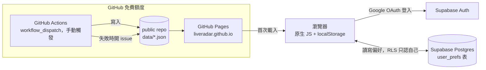

# LiveRadar 技術架構與實作規格書（SPEC）

| 項目 | 內容 |
|---|---|
| 文件版本 | v1.0 |
| 撰寫日期 | 2026-09-15 |
| 對應文件 | `LIVERADAR-SRS.md` v1.0（需求與驗收基準，本文件不重複其內容，只講「怎麼做」） |
| 本文件用途 | 開發前的技術決策基準。§11 分期實作計畫是 Phase 4 的直接施工清單 |

---

## 1. 系統架構總覽



- **前端**：純靜態網站，原生 ES Modules + 原生 CSS，無框架、無打包工具（D14）。部署於 GitHub Pages（`liveradar.github.io`，repo 名稱本身觸發 GitHub Pages 的根網域規則，不需要額外綁自訂網域）。
- **資料層**：不用資料庫存場次資料。所有場次資料是 repo 裡的 JSON 檔（`data/events.json` 等）。
  **更新（決策 S5，2026-09-17）**：改成人工手動觸發抓取，不是 GitHub Actions 每日自動 commit——`scripts/dev-server.mjs`（`npm run serve` 啟動）是本機專用的小型 Node 伺服器，設定頁的「🔄 重新抓取最新演出」按鈕只有透過它才會動作（而且只在 `localhost`/`127.0.0.1` 才會渲染出來，部署版完全看不到這顆按鈕，見 §8 尾段），部署在 GitHub Pages 上的正式版沒有這個功能（GitHub Pages 是純靜態主機，沒有後端可以跑 `fetch.mjs`）。這不算違反 D14——**部署出去的正式網站**仍然是零框架、零打包工具的純靜態頁面，只是多了一個「本機開發用」的小伺服器，用途類似 `python3 -m http.server` 曾經扮演的角色，只是多了一個 API 端點。細節見 §12 S5。**2026-09-21 補充實測**：手動觸發過一次 `workflow_dispatch` 在真實 GitHub Actions 環境跑，確認拓元／Ticket Plus 仍會回傳 403（跟 M11 記錄的封鎖問題一樣還在），所以排程沒有重新打開，`schedule` 觸發器維持拿掉。
- **偏好層（2026-09-20 起改版，取代原本的 Gist 同步／FR-65）**：收藏、排除規則、設定存在瀏覽器 `localStorage`；**登入 Google 帳號後**（透過 Supabase Auth）額外同步一份到 Supabase 的 `user_prefs` 表（Postgres，RLS 限定只有 `auth.uid()` 本人能讀寫）。登入是加分項不是門檻——不登入一樣能完整使用，登入只是為了跨裝置同步。細節見 §8。
- **運算全部在前端**：過濾、排序、分組、統計皆是瀏覽器端 JS 運算（NFR-02 <100ms），後端只負責「產生今天的資料快照」。
- **沒有自架伺服器、沒有自己的帳號密碼系統**：符合 N2、NFR-06 的精神（原文設計時假設完全沒有後端，Supabase 的加入是後來的決策，見 §8 開頭說明）。登入完全交給 Google OAuth，LiveRadar 本身不持有、不處理任何使用者密碼；Supabase 只當資料庫 + 驗證中介，不是我們自己維運的伺服器。

---

## 2. Repo 結構

```
liveradar/
├── index.html                  # 時間表（首頁）
├── new.html                    # 新上架
├── favorites.html              # 我的收藏
├── hidden.html                 # 已隱藏管理
├── review.html                 # 待整理
├── add.html                    # 手動新增場次
├── search.html                 # 搜尋藝人／標題（2026-09-18）
├── settings.html               # 設定
├── src/
│   ├── app.js                  # 各頁共用的啟動邏輯（載入資料、套用偏好、渲染）
│   ├── state.js                # localStorage 讀寫、Supabase 同步邏輯
│   ├── supabase.js             # Supabase client 單例 + getSession/signInWithGoogle/signOut
│   ├── filter.js                # §6 過濾決策樹的唯一實作（所有頁面 import 同一份）
│   ├── render.js                # DOM 渲染輔助（卡片、標籤、徽章）
│   ├── format.js                # 日期/價格/倒數計時格式化
│   └── components/              # 無框架下的「元件」＝渲染函式，非 class
├── styles/
│   ├── tokens.css               # ComponentSpec 畫布對應的 CSS variables（含深色 media query）
│   └── main.css
├── data/
│   ├── events.json              # 目前有效場次（正規化後）
│   ├── artists.yml              # 藝人別名表（人工維護）
│   ├── sources.json             # 各來源最後成功時間、筆數、狀態
│   ├── needs-review.json        # 待整理佇列
│   ├── digest.json              # 每日 diff 摘要（新增/更新/移除的場次 id）
│   └── watchlist.yml            # FR-19 手動版追蹤名單（M12 起）——不被任何程式讀取，
│                                 # 純粹給人類在對話裡叫 AI「照名單查一次」用，見 HANDOFF.md
├── scripts/                     # Node.js pipeline，手動觸發執行（決策 S5，不再靠 GitHub Actions 排程）
│   ├── fetch.mjs                # 入口：逐來源呼叫 adapter
│   ├── dev-server.mjs           # 本機專用伺服器（決策 S5），npm run serve 用這個，多一個 POST /api/fetch
│   ├── browser.mjs              # 共用 Playwright 啟動/關閉邏輯（withPage），kktix.mjs/fansi.mjs 共用，見 §5.5
│   ├── adapters/
│   │   ├── kktix.mjs             # SEARCH_VENUES 部分 2026-09-17 起改用 Playwright，見 §5.5
│   │   ├── tixcraft.mjs
│   │   ├── indievox.mjs         # M12 追加（2026-09-17），無反爬蟲，見 §5.4
│   │   ├── fansi.mjs             # M12 追加（2026-09-17），Playwright，見 §5.5
│   │   ├── ticketplus.mjs        # M12 追加（2026-09-17），公開 JSON API，見 §5.6
│   │   └── manual.mjs           # 讀取 data/manual-events.json，直接視為一個「來源」
│   ├── normalize.mjs             # 日期/場館/價格正規化＋藝人比對 artists.yml
│   ├── dedup.mjs                  # §4 ID 與去重演算法
│   ├── diff.mjs                   # 與前一版比對，產生 digest
│   └── notify.mjs                 # 來源異常時呼叫 GitHub API 開 issue
├── .github/workflows/
│   └── daily-update.yml
├── LIVERADAR-SRS.md
├── LIVERADAR-SPEC.md
└── README.md
```

**NFR-07 可維護性的落實方式**：新增一個來源＝在 `scripts/adapters/` 新增一個檔案，實作固定介面（見 §5），在 `fetch.mjs` 的來源清單註冊一行。不需要改動 normalize/dedup/diff 任何邏輯。

---

## 3. 資料模型

### 3.1 Event（正規化後，`data/events.json` 裡的單筆結構）

```ts
type Event = {
  id: string;              // 穩定 ID，見 §4.1
  merged_ids: string[];    // 這筆合併吸收過的其他來源 id（含自己）
  title_raw: string;       // 原始標題，供除錯與 AI 輔助解析回溯
  headliners: string[];    // 主秀藝人（正規化後名稱，對照 artists.yml）
  lineup: string[];        // 完整陣容（含配角）；音樂祭時等於全部參演藝人
  is_festival: boolean;    // D5：音樂祭類場次的封鎖判定走 lineup 但不影響主場次顯示
  venue: string;
  city: string;
  date: string;            // ISO 8601 date，e.g. "2026-10-15"
  time: string | null;     // "19:30" 或 null（未公布）
  on_sale_at: string | null; // ISO datetime 或 null
  price_min: number | null;
  price_max: number | null;
  status: "announced" | "on_sale" | "sold_out" | "postponed" | "cancelled" | "ended";
  tags_type: string[];     // 專場/巡迴/拼盤/音樂祭/見面會/簽唱會/音樂劇/古典（可複選，通常 1 個）
  tags_origin: string[];   // 本地/亞洲其他/日韓/歐美（2026-09-21 前叫「海外」，見 §3.2 附註）
  ticket_url: string;      // 優先序最高來源的連結
  sources: {               // 保留全部原始來源連結（AC-12 要求）
    name: string;          // "KKTIX" | "拓元" | "manual"
    url: string;
    raw_id: string;
  }[];
  first_seen_at: string;   // 首次被抓到的時間戳，供「新上架」判定 FR-23
  updated_at: string;      // 最近一次欄位有變動的時間戳，供 FR-34 收藏更新提示
  updated_fields?: string[]; // 這次更新變動了哪些欄位（時間/場館/狀態…）
};
```

### 3.2 Artist 別名表（`data/artists.yml`）

```yaml
- canonical: 深海系樂團
  aliases: ["深海系", "Deep Sea Band"]
  tags_origin_default: 本地
- canonical: ABC Band
  aliases: ["A.B.C. Band", "ABC樂團"]
  tags_origin_default: 歐美
```

人工維護，FR-16/US-16 的「待整理歸位」動作就是往這個檔案加一筆。

**2026-09-17 第一批補完**：五個來源都做完後，對照 342 筆待整理的原始標題手動判斷主秀，一次加了約 230 筆（草稿先寫進檔案讓人工用 `git diff` 審過，符合 D15「AI 可以先猜，但要人工確認」的精神，沒有自動 commit）。過程中兩個值得記住的教訓：
1. **canonical 太短、剛好是常見英文字的子字串會誤觸發**——加的「IVE」（韓國女團）會比對到任何包含「LIVE」的標題（LIVE 這個字本身就包含 ive），36 筆完全不相關的場次被誤判有 IVE 參演，改用更完整的「IVE WORLD TOUR」才修好。新增 3-4 個字母內的短英文 canonical，一定要用 `matchArtists()` 對照現有的 `needs-review.json`/`events.json` 標題跑一次交叉檢查，不要只憑感覺覺得「應該不會撞」。
2. **拓元／Ticket Plus 什麼票都賣**，`needs-review.json` 裡混了運動賽事、課程、展覽等非音樂項目（例如「Feedback Fascial Tools 筋膜刀專業技術課程」出現 13 次）——這些故意不加進 `artists.yml`（加了也不該被辨識成音樂演出），留在待整理頁用「忽略」按鈕手動清掉即可，不用改抓取邏輯去過濾，因為分類欄位在來源端本來就沒有給。

**2026-09-17 補完後重新 review 抓到的第二組同類 bug**：canonical `ASCA` 是 `派偉俊` 別名 `Patrick Brasca` 的子字串（不分大小寫），跟上面的 IVE/LIVE 是同一種問題。修法是拿掉 `Patrick Brasca` 這個別名（現有資料沒有任何一筆真的需要它）。這次額外補了系統性防護：`scripts/normalize.test.mjs` 新增一個測試，把 `loadArtists()` 讀到的全部 canonical/alias 兩兩交叉比對子字串包含關係，有任何一組就直接測試失敗——之後新增資料如果不小心又造出一組這種組合，`npm test` 會直接抓到，不用等到真的抓資料、標題誤判才發現。

`matchArtists()` 也修了一個排序問題：原本回傳順序是 `artists.yml` 的檔案宣告順序，不是標題裡真正的出場順序，而 `headliners[0]` 在別的地方被當「主秀藝人」用（排除選單顯示、`tags_origin` 預設值、`dedup.mjs` 算 id）。只有 2 筆資料時看不出問題，補完到 230 筆之後多主秀拼盤場次變常見，就會出現「主秀」其實只是資料檔裡宣告較早的藝人、跟標題裡誰先出場無關的情況。改成依照每個命中字串在標題裡的字元位置排序。連帶把 `normalize()` 的 `tags_origin` 從「只取 `headliners[0]` 一人的出身地區」改成「所有辨識到的 headliners 取聯集」，避免多主秀場次漏掉其他人的出身地區標籤。

**同一批修完後跑真實 pipeline 驗證，當場又抓到第三個同類 bug**：canonical `FLOW`（真實存在的日本搖滾樂團）比對到 LE SSERAFIM《PUREFLOW》巡演標題裡的「PUREFLOW」。IVE/LIVE、ASCA/Brasca、FLOW/PUREFLOW 三次都是同一種形狀的問題，說明根因是 `matchArtists()` 用 `.includes()` 做純子字串比對這個機制本身，不是個別名字「運氣不好」。**改成從根本修**：`findNameIndex()`（`matchArtists()` 內部）對純 ASCII 英數字的 canonical/別名要求前後是字邊界（前後字元不能也是英文字母/數字），中文或混合字元的名字維持原本的純子字串比對——中文沒有空白分詞，字邊界概念套不上，而且中文名字被包在更長標題字串裡本來就是預期、正確的情況。修好後拿全部真實抓到的標題把所有 4 字以內的純英文 canonical/別名跑過一次交叉核對，確認不再有子字串誤判，且沒有把原本該匹配的場次漏掉。

**2026-09-18 又抓到一種新的資料品質問題**：`爛泥發芽`、`RUSH BALL`、`FNC BAND KINGDOM` 這三個 canonical 其實是音樂祭/聯合公演的品牌名稱，不是單一演出者——當初補完那 230 筆時被誤判成藝人加了進去，導致 `guessTagsType()` 只認出一個「演出者」、標題文字裡又沒有「音樂祭」字樣，就被分類成「專場」而不是「音樂祭」。順便發現 `scripts/normalize.mjs` 的 `TYPE_KEYWORDS` 只認「音樂祭」，沒認「音樂節」這個一樣常見的同義詞（真實案例：「2026臺北爵士音樂節」也被誤判）。修法是在 `TYPE_KEYWORDS` 補上「音樂節」同義詞，以及這三個確認過的品牌名稱關鍵字，讓 `guessTagsType()` 不管標題怎麼寫都能正確辨識——這比把這三個名字從 `artists.yml` 移除更務實：它們本來就是使用者會拿來搜尋/辨識這場活動的字串，拿掉反而會讓這幾場變成待整理。因為增量抓取（§4.2）已經上線，已辨識過的場次不會自動重新分類，這次額外寫了一次性腳本直接對現有 `data/events.json` 重新跑 `guessTagsType()` 修正 7 筆受影響資料。

**2026-09-21：D15 反轉——未辨識藝人不再擋場次上架。** Max 拿一場真實漏掉的演出（Age Factory @ SUB LIVE）來問為什麼網站上看不到，追出兩層根因：

1. **KKTIX 涵蓋率缺口**：SUB LIVE 是「租場地、每場不同主辦單位」類型的場館，2026-09-17 那次涵蓋率修正（見 §5.1 cohesionmusic 那段）就已經點名 SUB LIVE／Zepp New Taipei／Blue Note／野地方 Wild Lab 這四個場館都需要加進 `kktix.mjs` 的 `SEARCH_VENUES`，但**只做了記錄沒有真的加**。這次一次補齊四個（Blue Note 目前查不到真的在賣票的場次，但成本只是每天多一次搜尋請求，一併加上）。
2. **`headliners.length === 0` 會讓整場都不會進 `events.json`**：Max 直接質疑這個設計——「有這麼多音樂人，不可能要求全部先手動登記過才會顯示」，這個質疑是對的。原本 `normalize()` 遇到辨識不到任何 headliner 的場次，直接回傳 `needsReview`，連 `parseVenue`/價格/`tags_type` 都不會算，場次完全不會出現在時間表上，`data/artists.yml` 事實上變成了一道「發現新演出前必須先手動登記」的關卡，違背整個工具「幫你發現還不知道的演出」的初衷。

**修法**：`normalize()` 拿掉這個早退邏輯，`headliners: []` 時照樣往下算 `venue`/`city`/價格/`tags_type`（`guessTagsType()` 本來就不靠 headliner 判斷關鍵字，只在關鍵字都沒中時才用 headliner 數量決定「專場」vs「拼盤」，0 個一樣正確落在「專場」），只是 `tags_origin` 留空（沒有辨識到的藝人就是不知道出身地，不用猜）。`fetch.mjs` 仍然把這類事件記進 `needs-review.json`（reason 保留 `artist_unrecognized`），但角色從「發布關卡」改成「待補分類清單」——事件已經在正式上架，這份清單只是提醒之後把藝人補進 `artists.yml` 能拿到 `tags_origin`/排除藝人這些額外功能，不補也完全不影響曝光。連帶修了 `render.js` 的卡片標題（原本直接 `headliners.join(" / ")`，`headliners` 是空陣列時會整個標題空白——改成沒有 headliner 時退回顯示 `title_raw`）以及 `fetch.mjs` 的 `buildKnownRawIdsBySource()`（未分類的事件不能算「已知」，否則增量抓取機制會在藝人補進名單後仍然沿用舊的空白分類，永遠不會重新正規化）。

**Max 進一步要求「不要叫我自己手動查來源地」**：確認之後，`artists.yml` 的定位變成「Claude 用 WebSearch 查證後填寫的快取表」，不是要 Max 自己一筆筆查。當天示範性地把清出來的 15 筆 `artist_unrecognized` 全部用 WebSearch 查證（不是憑印象猜）補齊，示範案例：MONO（日本後搖滾）、D'MASIV（印尼搖滾樂團——KKTIX 原始標題用彎引號 D'MASIV/U+2019，不是直引號，需要額外補一個別名才比對得到）、Karencici（美籍華裔但常駐台灣發展，比照告五人／Suming 的精神算本地）、Jony J（中國饒舌歌手，落在既有四分類「本地/日韓/歐美/海外」的「海外」，這個分類名稱同一天稍晚被 Max 要求改名成「亞洲其他」，見下方附註）等。這個查證動作被寫進每日排程（見 §10），變成例行流程的一部分，不需要 Max 手動介入。

**連帶修了一個測試本身的假陽性**：`artists.yml` 有一個既有的子字串碰撞防護測試（見上面 2026-09-17 那段），新增 canonical `MONO` 時觸發了它——`MONO` 是既有 canonical `Monomania偏執狂`的原始子字串。但 `findNameIndex()` 對純英文 canonical 已經有字邊界防護（`MONO` 後面緊接 `mania`，中間沒有邊界，不會誤判），只是這個測試本身還是用最原始的 `.includes()` 判斷，沒有套用同一套邊界邏輯，等於是拿一個比實際比對機制更嚴格、會誤報的規則卡資料。改成直接 export `findNameIndex()`，測試也改用它本人跑一次「A 名字放進 B 名字裡會不會真的比對到」，而不是自己重新發明一套更粗糙的子字串規則。

**同一天緊接著又抓到兩個問題**（Max 回報第二場漏掉的演出：MONO NO AWARE @ The Wall Live House）：

1. **The Wall Live House 的涵蓋率也有缺口**：The Wall 雖然在 `ORG_PAGE_VENUES` 裡（有專屬帳號、假設自我主辦幾乎全部場次），但這場票是外部主辦方用自己的帳號開的，完全沒出現在 The Wall 官方帳號的清單頁裡（確認過：近 250 場列表裡沒有這場）。修法：額外把 The Wall 加進 `SEARCH_VENUES` 當安全網，跟 `ORG_PAGE_VENUES` 疊加使用，不是二選一（搜尋關鍵字要用短的「The Wall」，完整的「The Wall Live House」在 KKTIX 搜尋裡查不到結果）。
2. **自己剛加的 canonical `MONO` 造成真實誤判**：新出現的「MONO NO AWARE」（另一個真實、不相關的日本樂團）被誤判成 `MONO` 的場次，因為前者的名字剛好完整以後者開頭，`findNameIndex()` 的字邊界規則在這裡「正確地」判定合法匹配（"MONO" 後面接空格），但語意上是錯的。這跟 IVE/LIVE、ASCA/Brasca 的「巧合重疊」不同——這裡兩個都是真實、想要正確辨識的藝人，純粹是「兩個候選命中同一個起始位置時該選誰」沒有規則。修法：`matchArtists()` 新增 tie-break——命中同一起始位置時保留較長／較具體的候選，捨棄較短的。連帶更新碰撞防護測試：命中位置為 0（單純的字首重疊）現在視為安全（有 tie-break 擋著），只有命中位置不是 0（藏在字詞中間，像 LIVE 裡的 IVE）才算真正的碰撞。

**另外處理一個 UI 問題**（Max 用截圖指出）：時間表往下捲動跨過跨年（畫面上「12月26日」接著「1月2日」）看不出年份已經換了。修法：`format.js` 的 `splitDate()` 只在日期年份不是「今年」時才在 `groupLabel` 前面加年份（例如「2027年1月2日」），同一年的分組維持原樣。

**同一天，來源地分類「海外」改名成「亞洲其他」。** Max 質疑「海外」跟「歐美」語意重疊（字面上歐美也是海外）。查證當時 `artists.yml` 裡實際標成「海外」的 11 位藝人，全部都是亞洲地區（泰國 SCRUBB/GMMTV、印尼 D'MASIV、中國 Jony J、新加坡 Shye、菲律賓 BINI、西藏 TIPA，加上幾個泛亞洲品牌活動）——不是隨便挑的例子，是全部資料的真實分佈，確認過不只是「東南亞」（有中國、西藏），但**也不是真的涵蓋全世界**，全部案例都落在亞洲。改名成「亞洲其他」比「海外」更精確，且跟「日韓」「歐美」放在一起語意上更一致（都是地理區域，不是「本地 vs 非本地」這種二分法）。

**已知取捨**：如果之後真的出現非亞洲、也不屬於歐美的巡演（例如非洲、中東、拉丁美洲藝人來台，目前完全沒有先例），「亞洲其他」這個名字會不夠用，屆時再視情況調整——這是接受目前真實資料分佈做的務實選擇，不是保證未來永遠不會再改名。

改動範圍：`data/artists.yml` 的 11 筆 `tags_origin_default: 海外` 全部改成 `亞洲其他`；`data/events.json` 裡已經算好的 `tags_origin` 陣列同步改字串（用一次性腳本改，不是重新抓取）；`src/app.js` 的 `ORIGIN_DISPLAY_ORDER`、`src/interactions.js`「指派藝人」對話框的來源地下拉選單也一起改。`npm test` 86 個測試全過。

### 3.3 UserPrefs（存在 localStorage，登入後同步到 Supabase，不進 repo）

```ts
type UserPrefs = {
  favorites: string[];              // event id 清單
  excluded_events: string[];        // 單場排除（US-10）
  excluded_artists: string[];       // 封鎖藝人（US-09），存正規化後 canonical 名稱
  excluded_types: string[];         // 封鎖類型（US-11）
  excluded_venues: string[];        // Phase 3, FR-49
  mute_keywords: string[];          // FR-43
  strict_mode: boolean;             // D2
  last_backup_at: string | null;    // FR-64
  updated_at: string;               // 供 Supabase 跨裝置衝突比對用（last-write-wins）
};
```

**2026-09-20 起不再有 `gist_id` 欄位**——跨裝置同步不再靠使用者自己的 GitHub Gist（原 FR-65／§8），改成 Supabase 帳號登入（Google OAuth），同步狀態不存在 `UserPrefs` 裡，而是看 `getSession()` 有沒有回傳登入中的 session。細節見 §8。

### 3.4 排除規則的資料結構補充

`excluded_artists` / `excluded_types` / `mute_keywords` 都是「規則」，不是「當下隱藏的場次快照」——這是 AC-42/AC-44 能通過的關鍵：規則存的是條件本身，每次渲染時即時比對，次日資料更新後新場次一樣會被同一條規則擋下，不需要重新操作。

---

## 4. 資料採集 Pipeline

### 4.1 ID 穩定性與去重演算法（對應 SRS R2、AC-12、負向測試）

```
raw_id  = adapter 回傳的來源原生 id（例如 KKTIX 的活動 slug）
id      = sha1( normalize(headliner) + "|" + date + "|" + venue_normalized )
```

- `id` 由**內容特徵**雜湊而來，不是隨機或遞增值：即使 KKTIX 改版換了 URL 結構，只要「主秀＋日期＋場館」不變，`id` 就不變 → 已排除的場次不會因為來源改版而重新出現。
- 跨來源合併：pipeline 對每筆 `RawEvent` 都算出這個 `id`；同一個 `id` 出現在多個來源時，合併為一筆，`merged_ids` 記錄全部命中的 `raw_id`，`sources[]` 保留所有原始連結，`ticket_url` 取來源優先序表（`KKTIX > 拓元 > manual`，可設定）中最高者。
- **早場／晚場不誤併**：`date` 只到天，若同日同場館但 `time` 不同且標題明顯不同（`headliner` 正規化後不同）則不視為同一 `id`（因為 headliner 不同，hash 自然不同）；若真的同名同場館同日不同時段，pipeline 額外加一條規則——當 `time` 差距 >= 3 小時且來源皆明確標示為不同場次時，於 `id` 中額外併入 `time` 分段（午場/晚場）避免誤併，此例外規則寫在 `dedup.mjs` 並附測試案例。
- **手動新增與自動抓取合併**（AC-17）：手動新增的場次一樣先算出 `id`；隔天自動抓取到同一場次時，`id` 相同 → 走一般合併流程，`sources` 多一筆 `manual`，不會重複顯示。

### 4.2 每日更新流程（實作對應 SRS §6.1 flowchart）

`scripts/fetch.mjs` 執行：

1. 讀取 `data/sources.json` 取得每個來源上次的成功筆數。
2. 對每個 adapter 執行 `fetch()`（見 §5 介面），有 timeout（30s）與重試（1 次）。**2026-09-18 起五個 adapter 平行執行**（`Promise.allSettled`），不再依序排隊——它們打的是完全不同的外部網站，彼此沒有共用的禮貌性流量限制（§4.3 的間隔只約束「同一 adapter 對同一網域」的請求），排隊等待純粹是浪費時間。細節與實測數字見下方「實作備註」。
3. 失敗 → 記錄 `sources.json` 該來源 `last_error`，`last_success` 維持不變，該來源本次沿用 `events.json` 中屬於它的舊資料（AC-11 負向情境）。
4. 成功但筆數為 0 且上次 > 0 → 呼叫 `notify.mjs` 開 GitHub issue（AC-14），同時前端從 `sources.json` 的 `status` 欄位讀出異常標示（ErrorState 畫面）。
5. `normalize.mjs`：日期／時間／價格字串轉換為 §3.1 型別；標題丟進簡單的正則＋`artists.yml` 比對抽取 `headliners`/`lineup`；抽不出來的進 `needs-review.json`（FR-16）。
6. `dedup.mjs`：套用 §4.1 演算法。
7. `diff.mjs`：與前一版 `events.json` 比較 `id` 集合與欄位值，產生 `digest.json`（新增/更新/欄位變動列表），供首頁「新上架」與收藏頁「已更新」使用。
8. 若 `digest.json` 顯示零差異 → **不 commit**（NFR-04 精神：沒必要就不動 repo，Pages 也不必重新部署）。
9. 有差異 → commit `data/*.json`，GitHub Pages 自動重新部署。

**實作備註（M10，2026-09-16）**：
- 步驟 3/4 的判斷邏輯抽成純函式 `scripts/source-status.mjs` 的 `classifySourceRun()`，方便直接單元測試，不用整條 pipeline 跑一次才能驗證。
- 步驟 4 的「上次 > 0」比較，用的是 `sources.json` 裡的 `last_count`，而且**只有真的成功抓到 >0 筆時才會更新這個值**——連續好幾天都抓到 0 筆，`last_count` 會一直停在最後一次成功的數字，讓每一天都持續判定為異常並持續告警，不會因為「今天 0 筆、昨天也記成 0 筆」而自己看起來恢復正常。
- `notify.mjs` 開 issue 前會先查有沒有同標題、帶 `source-anomaly` label 的 open issue，避免同一個來源連續故障時每天洗一個新 issue（呼應 SRS 的「每週維護時間 < 15 分鐘」）。
- 步驟 3「該來源本次沿用 events.json 中屬於它的舊資料」**已實作**（`scripts/source-fallback.mjs`，M11，2026-09-16）：`fallbackEventsForSource()` 從上一輪 `events.json` 抽出屬於該來源的貢獻（只留該來源自己的 `sources[]` 項目，拿掉 `id`/`merged_ids`），重新丟回這輪的 pipeline，讓 `dedupe()` 用同一套邏輯跟其他來源這輪抓到的新資料自然合併；`fallbackReviewItemsForSource()` 對 `needs-review.json` 做一樣的事。
  **緣起（M11 實測證實這不只是理論風險）**：2026-09-16 從 GitHub Actions 手動觸發一次真的執行，拓元回 403、KKTIX 的搜尋策略也全部 403（GH Actions 的 IP 疑似被這兩個網站的反爬蟲當成機房 IP 擋掉，本機測試因為是家用/公司 IP 所以一直正常），當時還沒有這個 fallback，直接把 `needs-review.json` 的 79 筆真實資料洗成 4 筆並自動 commit 上去，已用 `git revert` 復原。補上 fallback 後在真實 GitHub Actions 環境重跑一次驗證：同樣的 403 又發生，但這次資料維持在 79 筆，只有 metadata 變動，`daily-update.yml` 的排程已重新打開。**注意**：這個 fallback 只防止資料被洗掉，不解決封鎖本身——只要拓元/KKTIX 搜尋持續被擋，這兩個來源就不會有新資料流入，等同實質停止更新，是否要解決封鎖是另一個獨立的決定。細節見 `HANDOFF.md`「M11 的重大發現」。
- **五個 adapter 改平行執行（2026-09-18）**：抽出 `runAdapter()` 函式包住單一來源「抓取→分類狀態→異常時取用上次資料→逐筆 normalize」的完整流程，讓 `main()` 可以用 `Promise.allSettled(adapters.map(runAdapter))` 一次全部送出去，而不是 `for...of` 依序 `await`。刻意用 `allSettled` 不是 `all`：`runAdapter()` 內部已經把每一種已知的失敗模式都包起來（`adapter.fetch()` 拋錯、`notifySourceAnomaly` 失敗、單筆 `normalize()` 出錯），理論上不會真的 reject，但如果 `classifySourceRun()` 這類輔助函式本身出現未預期的錯誤，用 `allSettled` 才能保證不會因為一個來源的意外狀況，把其他四個來源已經抓好的成果也一起賠掉。實測：一次完整跑從依序版本的 19 分半降到平行版本的 8 分 52 秒，`data/sources.json` 五個來源都是 `status: "ok"`，筆數與平行化前一致，`npm test` 全過，沒有資料混雜或遺漏的跡象。
- **增量抓取（2026-09-18）**：`buildKnownRawIdsBySource()` 從 `previousEvents` 建出「每個來源已經成功辨識過的 `raw_id`」，傳給 `adapter.fetch(knownRawIds)`——每個 adapter 內部在自己的逐場詳情頁抓取迴圈前先比對，已知的直接標記 `reuse_previous: true` 並整筆跳過昂貴的詳情頁/價格請求；`runAdapter()` 看到這個標記就改呼叫 `fallbackEventsForSource(previousEvents, sourceName, rawIds)`（延伸自上面 M11 那段的 fallback 機制，多加一個 `rawIds` 篩選參數）直接沿用上次已經正規化好的資料，不重新跑 `normalize()`。**刻意排除 `needs-review.json`**：待整理項目每次都還是整批重新抓、重新 `normalize()`，因為這正是「使用者在 `artists.yml` 補上藝人後，重新抓取能把該筆場次從待整理轉正」這個工作流程本身依賴的機制，一旦被當成「已知、跳過」就會永久失效。代價：已收錄場次的票價/售罄狀態不會再更新，只有「有沒有新場次」會反映——為了「發現新演出」這個核心用途，這個取捨是划算的。實測時間演進：8 分 52 秒（純平行）→ 3 分 13 秒（加增量）→ 2 分 17 秒（再把 Ticket Plus 的 `sessions.json` 請求間隔從 2000ms 降到 500ms，一個大型商業售票平台的輕量 JSON API 呼叫沒必要套用給小型展演空間網站的同一個保守預設值）。詳細數字與拓元速度不穩定的未解問題見 `HANDOFF.md`。

### 4.3 爬取禮儀（NFR-04）

- 每個 adapter 內部 request 間隔 ≥ 2 秒（`await sleep(2000)`），非平行對同一網域打請求。
- 固定 User-Agent 字串標示 `LiveRadar/1.0 (personal use; contact: <email>)`。
- 讀取並遵守目標網域 `robots.txt`（pipeline 啟動時先 fetch 一次快取）。

---

## 5. 資料來源 Adapter 介面

每個 adapter 是一個 ES module，固定 export：

```js
// scripts/adapters/kktix.mjs
export const name = "KKTIX";
export const priority = 1; // 數字越小，去重時 ticket_url 優先序越高

export async function fetch() {
  // 回傳 RawEvent[]，欄位盡量貼近原始資料，不在這裡做正規化
  return [{
    raw_id: "thewalllivehouse-xxxx",
    title_raw: "深海系樂團 Live",
    url: "https://thewalllivehouse.kktix.cc/events/xxxx",
    venue_raw: "The Wall Live House",
    date_raw: "2026/10/15 19:30",
    price_raw: "800",
    status_raw: "on_sale",
  }];
}
```

`manual.mjs` 的 `fetch()` 直接讀 `data/manual-events.json`（手動新增場次表單寫入的檔案，見 §7），格式已經很接近 `RawEvent`，一樣要過 normalize/dedup，確保能跟自動抓取的結果合併（AC-17）。

**Phase 1 來源清單（D9）**：KKTIX、拓元 tixcraft、manual。Phase 2 候補：Accupass、ibon、iNDIEVOX、寬宏、年代。

### 5.1 KKTIX 端點實測結果（2026-09-15，M2 開發時實測）

實測發現 SRS §9.3 D9 的 org 清單裡，8 個場地其實分兩種完全不同的情況，**單一 org 頁面爬取法只對其中一半有效**：

| 場地 | 是否有專屬 KKTIX org 帳號 | 實測 slug |
|---|---|---|
| The Wall Live House | ✅ 自行主辦 | `thewalllivehouse.kktix.cc` |
| 海邊的卡夫卡 | ✅ 自行主辦 | `kafka.kktix.cc` |
| PIPE Live Music | ✅ 自行主辦 | `pipelivemusic.kktix.cc` |
| 浮現藝文展演空間 | ✅ 自行主辦（但有兩個帳號，需都抓） | `emergelivehouse.kktix.cc` + `emergelivehouse2.kktix.cc` |
| **Legacy Taipei** | ❌ 無專屬帳號 | 每場由不同主辦方（廠牌/公司）自己開帳號賣票，例如同一週的三場分別是 `youngteam`、`romanticoffice`、`airheadrecords` 三個不同 org |
| **Legacy Taichung** | ❌ 同上，推測同一營運模式 | 同上 |
| **Revolver** | ❌ 無專屬帳號 | 同上（實測到 `airheadrecords` 等） |
| **Clapper Studio** | ❌ 無專屬帳號 | 同上（實測到 `atc-twn`） |

原因：KKTIX 的「主辦單位（organizer）」概念對應的是廠牌/公司/企劃，不是場地。像 The Wall、卡夫卡這種場地本身兼營主辦（大部分場次自己開票）才會有一個好用的 org 頁面；Legacy／Revolver／Clapper 這類「租場地給外部主辦方」的場館，場次分散在幾十個不同 org 帳號下，沒有單一頁面可以爬。

**解法**：改用 KKTIX 的全站搜尋 `https://kktix.com/events?search={場館關鍵字}`（實測 `search` 才是正確參數名，`q`/`query` 無效），這是跨 organizer 的全文檢索。抓回來的每筆結果仍需要**在活動詳細頁比對場館欄位**（見下方 HTML 結構）以排除誤命中（例如活動描述提到「上次在 Legacy 演出」但這次其實在別的場地）。

因此 `kktix.mjs` 內部需要兩種抓取模式：

```js
// SPEC §5.1 — 兩種 KKTIX 抓取策略
const ORG_PAGE_VENUES = [
  { org: "thewalllivehouse", venueMatch: "The Wall" },
  { org: "kafka", venueMatch: "海邊的卡夫卡" },
  { org: "pipelivemusic", venueMatch: "PIPE" },
  { org: "emergelivehouse", venueMatch: "浮現" },
  { org: "emergelivehouse2", venueMatch: "浮現" },
];

const SEARCH_VENUES = [
  { keyword: "Legacy Taipei", venueMatch: /^Legacy(\s|$)/ },   // 場館欄位實測只寫 "Legacy"，靠地址分台北/台中
  { keyword: "Legacy Taichung", venueMatch: /^Legacy(\s|$)/ },
  { keyword: "Revolver", venueMatch: /^Revolver/ },
  { keyword: "Clapper Studio", venueMatch: /^Clapper/ },
];
```

Legacy Taipei 與 Legacy Taichung 的場館欄位都只寫「Legacy」，需要另外比對地址（台北市 vs 台中市）才能分辨，實作時務必寫測試案例覆蓋這個情況，避免兩個城市的場次互相搞混。

**2026-09-21 補齊 `SEARCH_VENUES`**：Max 拿一場真實漏掉的演出（`youngteam.kktix.cc/events/agefactory26`）來問，查出 SUB LIVE 也是「租場地、每場不同主辦單位」的同類場館，2026-09-17 那次涵蓋率調查（見下方 cohesionmusic 那段）就已經點名 SUB LIVE／Zepp New Taipei／Blue Note／野地方 Wild Lab 四個場館都該加進這個清單，但當時只做了記錄、沒有真的動手加。這次一次補齊：

```js
{ keyword: "SUB LIVE", match: (venue) => /^SUB LIVE/i.test(venue) },
{ keyword: "Zepp New Taipei", match: (venue) => /^Zepp New Taipei/i.test(venue) },
{ keyword: "野地方", match: (venue) => /^野地/.test(venue) },  // 見下方註解，字元變體問題
{ keyword: "Blue Note", match: (venue) => /^Blue Note/i.test(venue) },
```

實測時發現「野地方 Wild Lab」有兩種寫法同時存在於真實資料：一個主辦方的場館欄位用了 U+2F45（⽅，康熙部首）而不是正常的 U+65B9（方），兩者長得一模一樣但不是同一個字元，`match` 正則只取「野地」兩字前綴以同時涵蓋兩種寫法。Blue Note 目前搜尋不到真的在賣票、場館真的是 Blue Note 的場次（搜尋關鍵字命中的都是巧合，例如 Legacy Taipei、MOONDOG 等不相干場館），但既然是已知需要涵蓋的場館，還是加上了，成本只是每天多一次搜尋請求。

**同一次修正也發現一個殘留的小問題，先記錄未修**：SUB LIVE 底下至少一個主辦方（`theflabbergast`）用**英文地址**（"No. 99, Section 8, Civic Boulevard, Nangang District, Taipei City"）而不是中文地址，`cityFromAddress()` 只認中文城市名稱前綴，英文地址完全比對不到，該場次的 `city` 會落成「未知」而不是「台北」。目前只在這一個場次上觀察到，尚未評估是否要為英文地址另外寫一套判斷邏輯。

**兩個踩過的坑（M2 實作記錄）**：

1. **adapter 檔案裡絕對不要讓內部函式直接呼叫裸的 `fetch(...)`**——每個 adapter 依 §5 介面規範要 `export async function fetch()`，這會在整個模組內把全域 `fetch` API 遮蔽掉（function 宣告會 hoist）。結果是模組內任何地方寫 `fetch(url, {...})` 都會呼叫到自己那個零參數的 adapter `fetch()`，等於無窮遞迴呼叫自己，且因為每層遞迴前都有 `await sleep(2000)`，行為看起來就像「卡住但每 2 秒還有動靜」，非常難從外部行為判斷是死迴圈還是真的網路慢。**解法：模組內一律用 `globalThis.fetch(...)` 呼叫真正的網路 API**，`kktix.mjs` 已經這樣修正並留了註解，之後新增 adapter（拓元等）務必比照辦理。
2. `https://kktix.com/events?search=...` 這個全站搜尋端點 2026-09-15 M2 剛開發時，第一次請求偶爾回 403、重試一次幾乎都會成功，當時判斷是輕量機器人偵測，靠 §4.3 的「timeout + 重試一次」機制就夠。
   **更新（2026-09-17，M12 擴充場館時複測）**：這個判斷已經過期了——現在這個端點會回真正的 Cloudflare JS challenge（`<title>Just a moment...</title>`），重試完全沒用，而且**不是只有 GitHub Actions 的機房 IP 才會這樣，本機用一般家用網路、換成真的瀏覽器 User-Agent，一樣被擋**。也就是說 `SEARCH_VENUES`（Legacy Taipei/Taichung、Revolver、Clapper Studio）這 4 個場館目前實質上完全抓不到新資料，不分執行環境。`ORG_PAGE_VENUES` 用的 `<org>.kktix.cc/` 端點不受影響，還是 plain fetch 直接 200。要修好 `SEARCH_VENUES`，得換成能執行 JS、通過 Cloudflare 驗證的做法（例如 headless 瀏覽器），這已經不是「加減設定重試次數」能解決的層級，也要考量這樣做算不算規避網站的反機器人機制——是一個獨立、需要另外決定要不要投入的方向，見 `HANDOFF.md`「KKTIX 搜尋策略現況更新」。

### 5.2 KKTIX 頁面 HTML 結構（供 `normalize.mjs` 對照）

**Org 列表頁**（`https://{org}.kktix.cc/`，僅列出「近期公開活動」，未含價格）：

```
.current-events #event-list li.clearfix
  h2 > a                          -> title_raw, url（url 最後一段 slug 當 raw_id）
  .date .timezoneSuffix           -> date_raw，格式 "2026/09/16 20:00(+0800)"
  .description                    -> 簡介文字（可選，用於除錯）
```

**活動詳細頁**（`{url}`，含完整票價，normalize 階段一定要抓這層，org 列表頁資訊不夠用）：

```
.header-title h1                          -> title_raw（跟列表頁一致，取這裡更保險）
.event-info ul.info li:nth-child(1)       -> 完整日期時間（含中文星期，格式同列表頁）
.event-info ul.info li:nth-child(2)       -> "{場館名} / {完整地址}"（用 " / " split）
.organizers a:first-of-type                -> 主辦單位顯示名稱
table tbody tr                             -> 每一種票種一列
  td.name                                  -> 票種名稱
  .period-time .time .timezoneSuffix       -> 開賣/截止時間（各一個 span，前者開賣後者截止）
  td.price .currency-value                 -> 價格數字（有千分位逗號，需去除後 parseInt）
  .status.closed（若存在）                  -> 該票種已結束販售
```

**status 推導邏輯**：任一票種的販售區間涵蓋「現在」→ `on_sale`；所有票種都還沒到販售開始時間 → `announced`，`on_sale_at` 取最早一個開賣時間；所有票種都已經 `.status.closed` 且活動日期還沒到 → 暫定為 `sold_out`（無法區分「賣完」與「主辦方單純關閉線上售票改現場賣」，這是已知限制，寫進 README 讓未來的你知道，別誤以為是 bug）。

### 5.3 拓元 tixcraft 端點實測結果（2026-09-15，M3 開發時實測）

跟 KKTIX 完全不同的情況：**拓元有主動的反爬蟲防護，且列表頁與詳情頁的防護強度不一樣**。

- `https://tixcraft.com/activity`（節目列表頁）：純 UA／Referer 檢查，帶正常瀏覽器的 User-Agent 字串就能拿到完整 HTML（伺服器端渲染，200 OK）。裸 UA（例如 `curl` 預設或 Node `fetch` 沒帶 User-Agent）會被擋，回應 `{"response":"block"}`（HTTP 403）。
- `https://tixcraft.com/activity/detail/{slug}`（節目詳情頁，**票價在這裡**）：防護強得多。同樣的瀏覽器 UA、Referer、甚至帶著從列表頁拿到的 session cookie 一起送，一律回 `{"response":"identify"}`（HTTP 401）。實測用真瀏覽器（有執行 JS）可以正常看到內容，代表這層防護會執行某種 JS 挑戰（常見於 Akamai／PerimeterX 類服務），單純的 `fetch()` 過不去。

**Phase 1 決策（D16，2026-09-15，已於 2026-09-18 部分推翻，見下）**：拓元 adapter **只爬節目列表頁**（標題、日期、場館名稱），**不爬詳情頁**，代價是拿不到票價與售票狀態（`price_min/max` 留 `null`，`status` 一律 `announced`，前端顯示「票價請至頁面查看」並附上 `ticket_url` 導流）。要拿到價格需要上無頭瀏覽器（Playwright/Puppeteer）通過 JS 挑戰，這對 Phase 1 的免費額度／零維護目標（NFR-06、G5）不划算——GitHub Actions 加無頭瀏覽器會顯著拉長執行時間、增加相依套件的維護負擔，且拓元本來就是「大型海外巡演」的通路，使用者通常會自己點進 `ticket_url` 查價，比首頁直接顯示價格的急迫性低。若之後真的需要，可列入 Phase 3 再評估。

**D16 更新（2026-09-18）：詳情頁還是抓了，因為決策的前提條件已經不成立**。D16 當初的理由是「GitHub Actions 加無頭瀏覽器不划算」，但 S5（2026-09-17）已經把抓取改成純手動、只在使用者自己的機器上跑，Playwright 也已經因為 FANSI GO／KKTIX 搜尋策略變成既有相依套件——D16 的前提整個不再成立。使用者實際打開真實節目頁面確認**票價其實就寫在「節目介紹」分頁的自由格式文字裡**（例如「🎫 票價：NT$ 3,380起至 NT$ 7,980」），要求补上。做法：`scripts/adapters/tixcraft.mjs` 現在對**列表頁抓到的每一筆事件**都額外用 Playwright 開一次詳情頁，抓 `#intro`（節目介紹分頁，預設就是 active，不用點擊）的 `innerHTML`，交給 `normalize.mjs` 的 `parsePriceFromText()` 解析出價格區間。

**代價很實在，不是免費的**：這讓「重新抓取」從原本幾分鐘變成明顯更久——每一筆事件多一次完整的 Playwright 分頁載入（開分頁、導航、抓 DOM、關分頁），拓元一次通常有 80-140 筆事件。實測數字見 `HANDOFF.md`。為了不把成本疊加兩次，詳情頁請求之間的延遲（`DETAIL_REQUEST_DELAY_MS`＝800ms）比純 fetch 的 2000ms 短，理由是一次完整的瀏覽器導航本身就已經有真實的秒級延遲，不需要再疊加同等長度的人為等待。

**列表頁 HTML 結構**（`#all` 分頁，即「全部節目」，是「近期演出」與「最新開賣」兩個分頁的超集，直接爬這個就好）：

```
.eventbl .row.align-items-center   -- 每筆活動一個區塊，但同一筆會重複出現在頁面裡的不同版型（RWD 手機/桌面各一份），務必用 href 去重
  .date                             -- "2027/05/01 (六)  ~ 2027/05/02 (日) " 或單日 "2026/12/10 (四)"
  .text-bold a                      -- 標題 + href（/activity/detail/{slug}，slug 當 raw_id）
  .text-small.text-med-light        -- 場館名稱（純文字，無地址，例如 "高雄國家體育場(世運主場館)"、"Zepp New Taipei"）
```

**城市判定**：列表頁場館欄位沒有地址，無法像 KKTIX 那樣從地址判斷城市，只能比照 `artists.yml` 的精神，維護一份小型場館→城市對照表（`data/venues.yml`），碰到表裡沒有的場館就留 `city: null`，之後人工補。

**robots.txt 確認**：`Disallow` 只列了 `/activity/game/`、`/activity/search-suggest/`、`/ticket/area/`、`/ticket/ticket/`、`/ticket/verify/`，`/activity` 與 `/activity/detail/*` 都不在其中，抓取合規（NFR-04）。

### 5.4 iNDIEVOX 端點實測結果（2026-09-17，M12 覆蓋率追加來源時實測）

跟 KKTIX/拓元都不同：**伺服器端直接渲染，沒有 Cloudflare 也沒有 UA/Referer 檢查**，plain `fetch()` 直接可用，是目前唯一不需要任何反爬蟲對策的來源。代價是資料結構完全不受 CMS 約束——場館/日期資訊是主辦方自己貼的自由格式文字，不是固定欄位，需要盡力而為的解析，parse 不出來就留空/未知，不當成致命錯誤。

**兩步驟抓取**（跟 KKTIX 同樣需要進到詳情頁，因為列表頁只有標題+日期）：

1. 列表頁 `https://www.indievox.com/activity/list?type=card&startDate={YYYY/MM/DD}&endDate=`：一次回傳約 7 天份的卡片（`div.thumbnails.activity a[href*='/activity/detail/']`），用「取這批看到的最晚日期＋1 天」當下一批的 `startDate` 往前翻頁，直到某一批完全沒有新的 `href`（用 Set 去重）為止。
2. 詳情頁 `https://www.indievox.com/activity/detail/{raw_id}`：從自由格式的「🔻 活動資訊」文字區塊裡，用 `地點[｜:：]` / `日期[｜:：]` 這種「標籤 + 分隔符號」的 pattern 抓對應的值——**同一個標籤在同一頁可能出現不只一次**（例如某些活動除了介紹文字的「演出地點：」，頁面下方訂購表單還有一個不含年份的「日期：9/19」），實測抓到會誤觸後者，所以日期解析結果**必須驗證含有 4 位數年份**才採用，沒有就退回列表頁本來就有、格式穩定的日期字串。

**日期格式踩過的坑**：不同主辦方寫法差異很大，至少實測到三種都要分別处理：`2026.09.19`、`2026 / 10 / 2`（斜線兩邊帶空白）、`2026年10月3日`（純中文單位，沒有標點分隔數字）。`normalize.mjs` 的 `parseIndievoxDate` 依序嘗試中文單位格式、再嘗試斜線/點格式。時間部分優先取「XX:XX start」（演出開始），沒有就取頁面上第一個 `HH:MM`（通常是入場時間，比開演早，只是近似值）。

**場館格式**：多數有「場館名稱（地址）」可以直接比照 KKTIX 拆出地址判斷城市；少數只寫裸場館名稱（例如「野地方 Wildlab」），這種就退回 `data/venues.yml` 查表（跟拓元共用同一份表），查不到就 `city: null`。個位數活動完全沒填地點（自由格式文字，主辦方就是沒寫），也只能留空，不強求。

**2026-09-18 補上票價解析**：票價其實就在同一個「🔻 活動資訊」自由格式文字區塊裡（例如「票價：Shhh! ALL IN｜三場套票 9900元 / Self! SELECT｜單場票 3500元」），用 `地點`/`日期` 一樣的「標籤＋分隔符號」pattern 多抓一個 `票價[｜:：]` 就拿得到，**完全不需要多打一次請求**——本來就已經在抓的詳情頁 HTML 裡就有。抓到的原始字串交給 `normalize.mjs` 的 `parsePriceFromText()` 解析出數字區間（iNDIEVOX 這裡的格式是「數字＋元」，不是「$數字」，跟拓元／Ticket Plus 不同，該函式兩種都認得）。

### 5.5 FANSI GO 端點實測結果、以及用 Playwright 解決 Cloudflare 的決定（2026-09-17）

**FANSI GO（go.fansi.me）**：Max 帶來的參考實作示範用 Playwright 繞過反爬蟲，實測後發現：`/allevents` 這個列表頁本身**不是** Cloudflare 擋（plain fetch 拿到 200，沒有 challenge 頁），而是**整頁內容都是 Client-side render（Next.js），伺服器回應的原始 HTML 裡完全沒有場次資料**，一定要真的執行 JS 才會有內容。`/allevents` 列出全站所有還在賣票的活動，沒有分頁（實測滾到底部場次數不變）。

- 沒有任何結構化的場館欄位，連詳情頁都沒有——詳情頁是裝飾性海報風格文字（大量全形特殊字元），沒有像 iNDIEVOX 那種「地點｜」的固定標籤可以 pattern match。**列表卡片上的「organizer」欄位是目前唯一可用的線索**，常常就是真的場館（例如「百樂門酒館」「PIPE Live Music」），但有時候是廠牌/主辦方名稱（例如「Wrong Game Records」）——直接當 `venue` 使用，跟拓元「查不到地址就查 `venues.yml`」同一套取捨精神，不是每次都精準。
- 因為不需要進詳情頁，`fansi.mjs` 只有一步：載入 `/allevents`、等 JS 渲染完、單次 `$$eval` 抓完所有卡片。比 KKTIX/iNDIEVOX 的兩步驟抓取簡單、也更快。
- 日期格式（`<time datetime="...">`，例如 `"2026/09/19"`）跟拓元完全一樣，沒有時間資訊，`normalize.mjs` 直接重用 `parseTixcraftDate`/`parseTixcraftVenue`，沒有另外寫 `parseFansiDate`。

**用 Playwright 順便修好 KKTIX 的 `SEARCH_VENUES`**：既然專案已經要為 FANSI GO 加 Playwright 這個相依套件，順便把 `kktix.mjs` 的 `fetchSearchResultUrls`（M11/M12 一路記錄的 Cloudflare 擋爬蟲問題）也改用 Playwright——實測**確認修好了**：同樣的 4 個搜尋關鍵字（Legacy Taipei/Taichung、Revolver、Clapper Studio）這次全部成功，0 個 sub-request 失敗。原理：Cloudflare 的 JS challenge 只擋不會執行 JS 的請求（plain `fetch()`/`curl`），真的瀏覽器引擎會自動跑完那段驗證腳本再送出請求。`fetchOrgListing`／`fetchEventDetail` 兩個既有函式**沒有改**，繼續用 plain fetch——這兩個端點本來就沒有這層防護，沒必要為了不需要的地方多花啟動瀏覽器的成本。

**新增相依套件**：`playwright`（`npm install playwright` + `npx playwright install chromium`，後者會下載約 280MB 的 Chromium/Headless Shell 二進位檔到 `~/Library/Caches/ms-playwright`，不進 git）。共用的瀏覽器啟動/關閉邏輯抽到 `scripts/browser.mjs`（`withPage(fn)`），`kktix.mjs` 和 `fansi.mjs` 都用它，避免重複寫 `chromium.launch()`/`browser.close()` 的樣板程式碼。

**2026-09-18 補上票價：這次真的需要多開一次詳情頁**。FANSI GO 的詳情頁跟場館一樣沒有固定標籤可以 pattern match，但實測發現價格文字穩定放在一個 class 是 `.prose` 的 `<div>`（每個活動頁都有，用 class 選取，不用文字比對），只是格式一樣裝飾性很重（全形數字/貨幣符號，例如「ＡＤＶ．ＮＴ＄５００」，或純冒號分隔無符號的「預售票：600」）——`parsePriceFromText()` 的 fullwidth 正規化與關鍵字後備比對就是為了這個來源設計的。`scripts/browser.mjs` 因此新增 `withBrowser(fn)`/`newPage(browser)` 兩個匯出：讓呼叫端可以只啟動一次瀏覽器、對多個活動各開一個分頁，而不是像 `withPage(fn)` 那樣每次呼叫都重新啟動整個瀏覽器程序——FANSI GO 目前約 26 場活動，等於每次抓取多跑 26 次 Playwright 分頁導航，時間成本不像拓元的 80-140 筆那麼明顯，但一樣是真實增加，不是免費的。

**2026-09-21 修正：上面「沒有任何結構化的場館欄位，連詳情頁都沒有」這句話是錯的。** Max 質疑時間表上一堆「未知」城市，直接打開幾個 FANSI GO 事件頁面查證，發現詳情頁其實有結構化的場館名稱+地址區塊（`div.w-full.mt-2.mb-6 div.w-full` 底下兩個 `<p>`，第一個是場館名稱、第二個是地址），就在價格區塊(`.prose`)旁邊，同一次頁面載入就能一起抓——當初寫這個 adapter 時顯然沒有仔細找就下了「沒有」的結論。修法：詳情頁抓價格的同一次 Playwright 頁面載入，順便抓這個區塊，`venue_raw` 格式改成跟 KKTIX/Ticket Plus 一樣的「場館 / 地址」（不再是裸場館名稱），`normalize.mjs` 的 `VENUE_PARSERS` 拿掉 FANSI GO 專屬的 `parseTixcraftVenue` 覆寫，改用預設的 `parseKktixVenue`（地址判斷失敗時還會 fallback 查 `venues.yml`，兩層保險）。抓不到這個區塊時（例如某個活動頁版型跟其他不一樣）才退回列表卡片的「主辦方」欄位當場館，跟原本的取捨一致，只是變成最後手段而不是唯一手段。實測：FANSI GO 的未知城市場次從 16 筆降到 1 筆（唯一剩下的是真的辦在泰國清邁的活動）。

### 5.6 Ticket Plus 端點實測結果（2026-09-17，五個來源最後一個）

**五個來源裡資料品質最好的一個**，而且不需要 Playwright、不需要 Cloudflare 對策、也不需要自由格式文字解析。原始頁面（`ticketplus.com.tw`）是一個 Vue SPA，plain fetch 拿到的 HTML 只有約 6KB 的空殼，完全沒有場次資料——但它渲染畫面用的是一個**公開、不需要登入/API key 的 JSON API**：

```
https://apis.ticketplus.com.tw/config/api/v1/getS3?path={資源路徑}
```

- `path=main/mainEvents.json`：目前所有上架中的活動，`allEventId` 陣列（實測 91 筆）長度跟 `allEventMainPageInfo` 物件的 key 數量完全一致，確認這是**全站目錄**，不是首頁精選的子集。
- `path=event/{eventId}/sessions.json`：該活動底下每一場實際場次（一個活動可能有多場，例如同一巡演的台北/台中場、或同一天的日夜場），每筆都是結構化欄位：`name`（含場次區分，例如「01/09場次」）、`date`（`"2027-01-09 ~ 2027-01-09"`）、`time`（`"18:00 ~ 18:00"`）、`location`（場館名稱）、`address`（完整地址，含城市）、`hidden`（布林值，未上架/已下架的場次）。

**跟其他來源共用解析器**：`location`/`address` 兩個獨立欄位，adapter 組成 `"location / address"` 字串（跟 KKTIX 的 `venue_raw` 格式完全一樣），`normalize.mjs` 直接重用 `parseKktixVenue`，沒有另外寫函式；日期是 `date`+`time` 兩個欄位串在一起（`"2027-01-09 ~ 2027-01-09 18:00 ~ 18:00"`），新寫了 `parseTicketPlusDate` 抓開頭的日期跟第一個時間。

**踩過的一個小坑**：少數活動的「場次」其實是官方週邊商品預購，不是真的表演（`location` 欄位會是「預購商品」這種非場館字串），用 `session.name.includes("周邊商品")` 濾掉，跟 FANSI GO 濾掉「周邊」性質列表同一個精神。

**2026-09-18 補上票價**：`sessions.json` 完全沒有價格欄位，但同一個 API 底下還有 `path=event/{eventId}/event.json`，裡面的 `info` 欄位就是「活動介紹」分頁的原始 HTML，票價寫在類似「演出門票｜預售單人$1,000/ 預售雙人$1,800/」這樣的一行裡——**這是五個來源裡取得票價成本最低的一個**：不用 Playwright，就是多打一個一樣公開、不用登入的 JSON API（每個 `eventId` 打一次，不是每個場次都打一次，因為票價是整場活動共用，不分場次）。

**這是五個來源裡對覆蓋率貢獻最大的一次追加**：對照 M12 的 29 場覆蓋率樣本，光是加入 Ticket Plus 就多命中 7 場（見 `reports/coverage-sample-2026-09-17.md`），因為它剛好覆蓋了女巫店、Zepp New Taipei、The Wall 這幾個先前完全碰不到的場館——這幾個場館主要就是透過 Ticket Plus 賣票，不在 KKTIX/拓元的售票生態圈裡。

---

## 6. 前端過濾決策樹（實作規範）

`src/filter.js` 是**唯一**允許實作這段邏輯的地方，所有頁面（首頁、新上架、收藏）都呼叫同一個函式，不得各自重寫，否則 FR-33/FR-44 容易在某個頁面漏掉：

```js
// src/filter.js
export function resolveVisibility(event, prefs, viewFilters) {
  if (isPast(event.date)) return { bucket: "ended" };
  if (prefs.favorites.includes(event.id)) return { bucket: "show", pinned: true };
  if (prefs.excluded_events.includes(event.id)) return { bucket: "hidden", reason: "event" };
  const hitArtist = prefs.strict_mode
    ? event.lineup.some(a => prefs.excluded_artists.includes(a))
    : event.headliners.some(a => prefs.excluded_artists.includes(a));
  if (hitArtist) return { bucket: "hidden", reason: "artist" };
  if (event.tags_type.some(t => prefs.excluded_types.includes(t))) return { bucket: "hidden", reason: "type" };
  if (prefs.mute_keywords.some(kw => event.title_raw.includes(kw))) return { bucket: "hidden", reason: "keyword" };
  if (!passesViewFilters(event, viewFilters)) return { bucket: "filtered" }; // 不計入排除統計
  return { bucket: "show" };
}
```

順序**不可調換**（SRS §6.3 明文要求）：已結束 → 已收藏（提前短路，永不被排除規則擋下）→ 單場排除 → 藝人 → 類型 → 關鍵字 → 畫面篩選器。`hidden` 各 reason 的計數加總即為頁尾「另有 N 場被規則隱藏」的數字；`filtered`（城市/月份/價格篩選器篩掉的）不計入這個統計。

**2026-09-18 補上首頁的城市/月份/價格 chip UI**：`passesViewFilters()` 這段邏輯其實從一開始就寫好也測過，但首頁 `index.html` 的「全部城市／10月／價格」三個 chip 一直是完全沒接上任何邏輯的靜態裝飾——這次補上：
- `src/interactions.js` 新增 `openFilterSheet(title, options, currentValue, onSelect)`，跟既有的 `openExcludeMenu()` 共用同一套 bottom sheet 視覺，單選、點了立刻套用並關閉，不需要額外「確定」按鈕。
- `src/app.js` 的 `wireViewFilterChips()` 在 `initTimeline()` 裡把三個 chip 接上 `openFilterSheet`，城市/月份選項**從尚未結束的場次動態算出**（不是寫死清單）——刻意排除已結束的場次，否則會出現選了也一定是空清單的死選項（例如今天是 9/18，若選項清單沒濾掉 7 月、8 月，使用者選了只會看到「目前沒有符合條件的演出」）。價格是固定的 4 個級距（NT$500/1000/2000/3000 以下）+「不限價格」。
- 篩選狀態存在 `localStorage`（`liveradar:view_filters`），**刻意不放進 `UserPrefs`、不走 Supabase 同步**——這是「當下正在看什麼」的畫面狀態，不是像 `excluded_artists`那樣要長期生效、跨裝置同步的規則（呼應 §3.3 的既有設計）。

**2026-09-18 再加碼：新增「類型」跟「音樂人地區」兩個篩選 chip**：`passesViewFilters()` 補上 `type`（比對 `event.tags_type`）跟 `origin`（比對 `event.tags_origin`）兩個條件，跟既有的 city/month/priceMax 同一套機制、可以疊加使用。選項一樣動態算自尚未結束的場次（`typeFilterOptions()`/`originFilterOptions()`），只列出目前資料裡真的存在的類型/地區，不會出現選了保證空清單的死選項。`src/filter.test.js` 新增 3 個測試涵蓋單獨篩選跟疊加篩選。

**2026-09-18 同時發現、同時補上：頂部「搜尋」放大鏡按鈕也是同一種沒接邏輯的靜態裝飾**，SPEC 裡本來就沒有這個功能的 FR 編號。補法是新增獨立的 `search.html` 頁面（跟 `review.html`/`add.html` 一樣用 `.app--no-nav` + 返回鍵樣式，不是彈出疊層），`src/app.js` 新增 `initSearch()`：
- 即時比對輸入框內容跟 `event.title_raw`／`event.lineup`（不分大小寫），輸入時就更新結果，不用按 Enter 或搜尋按鈕。
- 套用跟其他頁面一樣的 `partitionEvents()` 規則（已收藏優先顯示、已排除的規則一樣生效）——搜尋不是繞過封鎖規則的後門，跟時間表頁行為一致。
- **不**套用城市/月份/價格 view filters（`partitionEvents(events, prefs, {})`），也**不**搜尋已結束的場次——這是獨立的「找一個東西」功能，跟時間表「現在看哪些」的畫面篩選是兩回事。
- `index.html`/`new.html`/`favorites.html` 頂部的搜尋按鈕從無動作的 `<button>` 改成 `<a href="./search.html">`，純連結不需要 JS。

---

## 7. 手動新增場次（FR-17）的落地方式

因為前端沒有伺服器可以直接寫 repo，`add.html` 的「儲存」實際上是：

1. 寫入使用者自己的 `localStorage`（`liveradar:manual_events`），畫面上立刻可見、可收藏、可排除（符合 AC-17 的「行為與自動抓取一致」——`loadEvents()` 把 manual events 跟 `events.json` 合併成同一個清單餵給 `filter.js`）。
2. **登入 Google 帳號的話**，額外同步進 Supabase 的 `user_prefs.manual_events` 欄位（跟 `UserPrefs` 同一列一起同步，見 §8），這樣手機新增、桌機也看得到；沒登入的話就只留在本機，跟 Phase 1 最簡化版本一樣。
3. 下一次 GitHub Actions／本機 `npm run fetch` 執行時，pipeline **讀不到**使用者的 localStorage/Supabase（那是私人資料，pipeline 沒有存取權限）——所以 AC-17 第二條「手動新增的場次日後也被自動抓到時合併為一筆」的實作方式是：手動新增的場次**永遠只存在該使用者的本機/Supabase**，不進 `data/manual-events.json`，因此它是「個人補件」而非「全站資料」；若隔天自動抓到同一場次，前端合併時以 `events.json` 版本為主，本機版本視為重複而不重複顯示——比對用的不是單一 `id`，而是 `possible_real_ids`（一場秀之後可能被拆成午/晚場等 bucket-suffixed id，manual event 要能跟任何一種未來結果匹配掉重複，見 `src/id.js`），滿足 AC-17 的「不得重複顯示」，但不需要真的寫回 repo。

---

## 8. Supabase 帳號登入與同步機制（2026-09-20 上線，取代原本的 Gist 同步／FR-65）

**這節原本描述的是 Gist 同步（使用者貼 GitHub Personal Access Token，`reconcileGistSync()`）——2026-09-20 全面換成 Supabase 帳號登入 + Postgres 同步，Gist 那條路徑已經完全從程式碼移除，不是並存的備援。**換掉的原因：貼 PAT token 對一般使用者太技術性，Max 想要一般網站常見的「登入帳號」體驗。原本連 email/密碼登入都做了，但 Supabase 免費方案寄出的驗證信/重設密碼信用共用網域、內容不能客製（要客製得接自訂 SMTP + 自己的網域），容易被誤認成詐騙信，所以最後**只留 Google 登入**——Google 本身就是身分驗證，完全不涉及 Supabase 寄信。

- **Client**：`src/supabase.js` 建立單一 Supabase client（`@supabase/supabase-js@2.116.0`），**vendor 進 repo**（`vendor/supabase-js.min.mjs`，用 esbuild 打包成單一無相依 ESM 檔），不是執行期從 esm.sh 這類 CDN import——CDN 版本雖然網址釘死版本號，但實際上會再 re-export 一整棵其他 esm.sh 子模組，ES module `import` 沒有 Subresource Integrity 可以釘住這些子請求，等於每次載入都要信任 esm.sh 當下在跑的東西。Vendor 一份下來後，這個檔案就跟專案其他靜態資源一樣是 commit 進 repo 的固定內容，不受 CDN 影響（regenerate 方式見 `vendor/README.md`）。Project URL／anon key 直接寫死在 `src/supabase.js`（這兩個本來就是設計給前端公開用的，不是機密，存取控制靠 Postgres RLS，不是靠藏這把 key）。
- **登入**：只有 `signInWithGoogle(redirectTo)`，呼叫 Supabase 的 `signInWithOAuth({ provider: "google" })`，走標準 OAuth 授權碼流程，整頁導到 Google 同意畫面再導回來。**登入是加分項不是門檻**——不登入一樣能完整使用 LiveRadar（收藏/排除/設定都正常運作在本機 `localStorage`），登入只是為了讓這些設定跨裝置生效。
- **資料表**：`public.user_prefs`（`user_id`／`prefs` jsonb／`manual_events` jsonb／`updated_at`），RLS 只允許 `auth.uid() = user_id` 讀寫自己的列，`grant select, insert, update` 給 `authenticated` role（沒有 `delete` policy，目前沒有刪除帳號功能；`anon` 完全沒有存取權，匿名讀寫會回 401，已實測驗證）。完整 SQL 見 `supabase/schema.sql`。
- **同步策略**：**last-write-wins**，比較 `UserPrefs.updated_at`，邏輯跟原本的 Gist 機制一模一樣（只是資料來源從 GitHub Gist API 換成 `supabase.from('user_prefs')`）：
  1. `reconcileSupabaseSync()` 在每個會讀 prefs 的頁面（時間表／搜尋／新上架／收藏／已隱藏管理）載入時呼叫一次。
  2. 沒登入 → early return，不發任何網路請求（跟原本沒連 Gist 時同一個精神）。
  3. 已登入但雲端還沒有這個使用者的列（第一次登入）→ 直接把本機資料 push 上去當種子資料，不需要額外的「搬移」按鈕。
  4. 雲端已有資料 → 比較雙方 `updated_at`，較新的一份覆蓋較舊的一份（不做欄位級合併），本機贏的話順便 push 回去讓兩邊收斂。
  5. 任何網路失敗都只是「留在本機繼續運作」，不會清空本機資料（跟 AC-65 原本的負向測試同一個精神）。
  6. 每次使用者操作（收藏/排除/設定變更）→ debounce 2 秒後 `pushToSupabase()`，避免每次點擊都打 API。
- **手動新增場次（US-17）同一列一起同步**：不屬於 `UserPrefs` schema，但存在 `user_prefs.manual_events` 欄位跟 prefs 一起同步，改動時會連帶 bump `prefs.updated_at`，讓另一台裝置的 last-write-wins 比較能偵測到並抓下來（見 §7）。
- **畫面篩選狀態刻意不同步**（城市/月份/價格/類型/地區 chip、收藏頁列表/日曆切換）——這是「當下在看什麼」，不是「跨裝置生效的規則」，維持只存 `localStorage`（見 §6 相關段落）。
- **設定頁只有一顆帳號卡（登入狀態）+ 一顆備份卡（匯出/匯入 JSON，FR-63/64）**，2026-09-21 拿掉了原本額外顯示的「跨裝置同步」狀態徽章——帳號卡片的登入/登出狀態本身已經隱含同步是否生效，不需要重複的 UI。
- **設定頁「重新抓取最新演出」按鈕只在 `localhost`/`127.0.0.1` 才會渲染**（2026-09-21）——這顆按鈕只有本機 `npm run serve` 才連得到 `/api/fetch`，部署版一般使用者按了只會看到「連不上本機伺服器」的錯誤，對他們沒有意義，索性不渲染。「來源狀態」清單本身（各平台更新時間／最近筆數）仍然對所有使用者顯示，但拿掉了 status 徽章跟 `last_error` 這種給開發者看的原始錯誤字串（例如 `GET ... -> 403`）。

**已實測驗證的部分**：真的走完一次 Google 登入流程（離開網站到 Google 同意畫面再跳回來）、直接查 `user_prefs` 表確認真的寫入一筆資料、用匿名請求測過 RLS 真的擋得住（401）。**過程中修好的真實 bug**：OAuth 失敗（例如 Client Secret 不是最新值）原本完全不會顯示在畫面上，使用者點登入、走完流程、跳回來只會靜靜維持「未登入」，只能自己看網址列的 `error_description` 參數才找得到線索——已修好，`initSettings()` 現在會檢查這個參數並 `alert()` 顯示出來。

**跟改名/搬遷一起發生的行為（2026-09-21，不是 bug）**：Supabase session 存在瀏覽器 `localStorage`，是**按網址（origin）分開儲存**的——LiveRadar 從舊網址搬到 `liveradar.github.io` 後，瀏覽器在新網址上本來就讀不到舊網址存的登入資料，使用者會看到「被登出」，這是瀏覽器儲存機制的必然結果，不是同步邏輯的問題，重新登入一次即可，之後會正常留住。

---

## 9. 深淺色模式（FR-27）

`styles/tokens.css` 定義一份 CSS variables（對應設計稿 ComponentSpec 畫板的兩組 token），淺色寫在 `:root`，深色寫在 `@media (prefers-color-scheme: dark)`。所有畫面樣式一律用 `var(--xxx)`，不得寫死色碼，這樣新增畫面時深色模式是自動生效的，不需要每頁另外處理。2026-09-18 起加上手動切換開關，見 §9.4。

### 9.1 響應式縮放（RWD，2026-09-18）

LiveRadar 原本完全 mobile-first（`.app{max-width:480px}`，SPEC 一開始就定調手機是主要裝置），在桌機瀏覽器上就是畫面中間一條窄窄的欄，兩側大量留白。Max 要求「除了手機版之外，用不同尺寸做 RWD 縮放」，做法：

- **兩個新斷點**：`min-width:800px`（平板）與 `min-width:1200px`（桌機），`.app` 分別放寬到 820px／1180px。
- **場次列表改用 CSS Grid，其他內容維持單欄**：這是這次改動的核心判斷——「哪裡值得變寬」跟「哪裡該維持窄欄」不一樣。`.event-list`（有 `.event-card` 直屬子元素的頁面，如收藏頁／搜尋結果的空狀態）跟 `.day-group`（時間表／新上架這種按日期分組的頁面）在寬螢幕下改成 `display:grid; grid-template-columns:repeat(auto-fit, minmax(340px,1fr))`，讓場次卡片並排顯示，而不是被迫排成一條長長的單欄。用 `:has(> .event-card)` 選擇器分辨「這個 `.event-list` 底下是不是直接放卡片」，因為同一個 class 在不同頁面的巢狀結構不一樣（時間表是 `.event-list > .day-group > .event-card`，收藏頁是 `.event-list > .event-card` 沒有 `.day-group` 這層）。`auto-fit`（不是 `auto-fill`）確保當某一天只有 1-2 場時，卡片會撐開填滿那一列，不會留下奇怪的空白欄位。

**2026-09-18 補上 `align-items:stretch`**：Max 打開實際畫面發現同一列裡標題長度、有沒有徽章（例如「已收藏，忽略排除規則」）不一樣的卡片，高度長短不一，同一列參差不齊很醜。原本用 `align-items:start` 讓每張卡片維持自己的自然高度，改成 `align-items:stretch`（grid 預設值）並讓 `.event-card{height:100%}` 撐滿格子高度，同一列的卡片就會統一成那一列最高卡片的高度——較短的卡片下方會多一點留白，但整列看起來整齊，比高低不一好看。只在 `min-width:800px` 斷點生效，手機版單欄排列本來就不會有這個問題。
- **新增 `.page-content` class**：表單、設定頁、待整理／已隱藏管理這種「本來就該維持單欄閱讀寬度」的內容，即使 `.app` 變寬了也不該跟著被拉伸成又寬又扁的輸入框——`.page-content{max-width:560px;margin:0 auto}` 蓋在這些頁面的內容容器上（`add.html` 的表單、`settings.html`／`review.html`／`hidden.html`／`search.html` 的內容區與標題列），讓它們在寬螢幕下維持置中、舒適的閱讀寬度，跟旁邊留白，而場次列表頁（時間表／新上架／收藏）的標題列刻意不套用這個 class，讓標題跟下面變寬的格線對齊。
- **底部導覽列／彈出選單同步加寬**：`.bottom-nav`／`.sheet` 的 `max-width` 跟著 `.app` 的兩個斷點一起放寬，維持視覺上跟內容區同寬，不會變成寬螢幕裡一條突兀的窄導覽列。
- 手機尺寸（<800px）完全不受影響，沒有新增任何 media query 影響到既有行為；800px 以下的邏輯就是原本的樣子。
- 沒有改動任何 JS 邏輯或元件標記結構，純粹是 CSS media query + 少數幾個頁面補上 `class="page-content"`，`npm test` 58 個測試全過（本來就跟這次改動無關）。實測過 390px（手機）／834px（平板）／1280px（桌機）三種寬度下的時間表、新上架、收藏、搜尋、設定、待整理、已隱藏管理、手動新增場次八個頁面，都正確縮放且沒有 console 錯誤。

### 9.2 桌機專屬打磨：側邊導覽列、滑鼠 hover、字級（2026-09-18，同一天）

Max 看過 9.1 的成果後自己提出四個進一步調整，這次全部做完：

- **底部導覽列在 `min-width:1200px` 改成左側直向導覽列**：一條貼在畫面最下面的分頁列是手機/觸控裝置的慣例，在寬桌機螢幕上要低頭看到底才找得到導覽，改成固定在左側、垂直置中的窄欄（96px 寬），導覽入口隨時在視線範圍內，更貼近桌機慣例。`.app` 對應改成 `padding-left:96px`（取代原本給底部導覽列預留的 `padding-bottom`），`.app--no-nav` 頁面（沒有導覽列的子頁面）不受影響。原本 `+ 新增場次` 的浮動按鈕（FAB）從貼著底部導覽列右上角，改成貼著側邊欄頂端置中。**只在桌機斷點生效**，平板（800-1199px）維持底部導覽列——平板常見觸控操作場景，跟桌機的滑鼠情境不同。
- **字級微調（僅桌機斷點）**：卡片變寬到 300-400px 之後，手機版的字級比例看起來偏小、留白偏多，把 Logo、頁面標題、卡片標題、日期數字幾個關鍵字級在桌機斷點各加大一些，平板斷點維持原樣（卡片寬度跟手機差不多，不需要跟著調）。
- **滑鼠 hover 回饋**：卡片、按鈕、chip、導覽項目等互動元件補上 `:hover` 樣式（卡片浮起+陰影、按鈕變亮/變暗等），包在 `@media (hover:hover) and (pointer:fine)` 裡——這個媒體查詢刻意排除觸控裝置，因為觸控螢幕點一下会讓 `:hover` 樣式卡住直到點別的地方才消失，手機版絕對不能套用。
- 這批全部是 CSS 改動，`npm test` 58 個測試全過（純樣式，不影響任何邏輯）。實測時發現瀏覽器分頁工具在「先縮放視窗、再導覽網址」的操作順序下偶爾會有畫面沒跟著版面重新繪製的暫時性顯示問題（用 `getBoundingClientRect()` 確認過底層 DOM/CSS 版面其實是對的，純粹是那次截圖畫面沒更新）；改成「先導覽、再縮放視窗」後就穩定重現正確畫面——這是瀏覽器分頁工具本身的限制，不是網站的問題，寫下來提醒自己下次遇到「畫面看起來擠成一團但程式邏輯測起來正常」時，先怀疑截圖工具而不是急著改 CSS。

### 9.3 收藏頁日曆檢視（2026-09-18）

`favorites.html` 除了原本依日期排序的列表，新增一個月曆檢視，用「列表」／「日曆」兩個 chip 切換（存在 `localStorage` 的 `liveradar:fav_view`，畫面狀態、不走 Supabase 同步，跟 §6 的城市/月份/價格篩選器同精神）。

- 新增 `src/calendar.js`：純函式 `buildMonthGrid(year, month)`／`addMonths(year, month, delta)`，不碰 DOM，照專案慣例獨立成好測試的邏輯檔（同 `format.js`／`filter.js` 的模式）。
- 月曆格子有收藏場次的日期標示圓點，點下去在下方顯示當天場次；預設開啟會自動跳到最近一場收藏所在的月份並選好那一天。
- **實作時抓到兩個真實的選取狀態卡住的 bug**：（1）翻月份後，畫面選取的日期沒有跟著清掉，導致月曆換了月份、下方卻還顯示上個月的場次；（2）在日曆檢視裡把當前選取那天的場次取消收藏後，選取狀態沒有跟著失效，一樣會顯示已經不存在的資料。兩處都補上「重新驗證選取日期是否還有對應場次，沒有就清空並改顯示『這個月沒有收藏的場次』」的邏輯。

### 9.4 手動深淺色切換開關（2026-09-18）

Max 反映「深色看久眼睛有點痛」，要求加一個手動切換按鈕，不要完全只跟系統走。原本 §9 開頭講的「跟隨系統、不做手動開關」在這裡被推翻，改成三層 CSS override，越後面優先權越高：

1. `:root`（淺色，預設不變）
2. `@media (prefers-color-scheme: dark) { :root:not([data-theme="light"]) {...} }`（系統深色，但如果使用者已經明確選了淺色就不覆蓋——`:not([data-theme="light"])` 是關鍵，避免「使用者手動選淺色、但系統是深色」被系統設定蓋回去）
3. `:root[data-theme="dark"]` / `:root[data-theme="light"]`（使用者在設定頁明確選的，蓋過系統設定）

`data-theme` 屬性設在 `<html>` 上，由每個頁面 `<head>` 裡的一小段**同步**（非 `type="module"`）inline script 負責，在 `<title>`／CSS 之前執行：

```html
<script>(function(){try{var t=localStorage.getItem("liveradar:theme");if(t==="light"||t==="dark")document.documentElement.dataset.theme=t;}catch(e){}})();</script>
```

一定要是同步 inline script、而且要放在最前面——`app.js` 是 `type="module"`，瀏覽器會延後執行到 DOM 解析完，如果靠它來設定 `data-theme` 會在每次換頁時先閃一下錯誤的主題（FOUC）才跳到正確主題。八個頁面（`index/new/favorites/search/add/review/hidden/settings.html`）都加了這段。

`src/state.js` 新增 `loadTheme()`（回傳 `"system"|"light"|"dark"`，key 不存在時視為 `"system"`）／`saveTheme(theme)`（`"system"` 時移除 key 並清掉 `data-theme`，否則寫入並設定）。`settings.html` 新增「顯示模式」區塊（三個 `chip-selectable` 按鈕，`data-theme-value="system"/"light"/"dark"`），`app.js`／`initSettings()` 監聽點擊、呼叫 `saveTheme()`、用 `aria-pressed` 做互斥的單選視覺回饋，頁面載入時依 `loadTheme()` 設定初始按下狀態。

實測過三種狀態切換（系統深色下強制淺色、系統淺色下強制深色、切回跟隨系統後 `data-theme` 正確清除）以及跨頁導覽（設定頁選深色 → 導覽到時間表頁 → 深色設定有維持，沒有 FOUC 閃爍）。`npm test` 72 個測試全過（純 CSS/HTML/少量 JS 加法，不影響既有邏輯）。

---

## 10. GitHub Actions 設定

```yaml
# .github/workflows/daily-update.yml
name: Daily Update
on:
  schedule:
    - cron: "0 0 * * *"   # 08:00 CST = 00:00 UTC（D1）
  workflow_dispatch: {}    # 方便手動觸發除錯
jobs:
  update:
    runs-on: ubuntu-latest
    steps:
      - uses: actions/checkout@v4
      - uses: actions/setup-node@v4
        with: { node-version: 20 }
      - run: node scripts/fetch.mjs
      - run: |
          git config user.name "liveradar-bot"
          git config user.email "actions@users.noreply.github.com"
          git add data/
          git diff --cached --quiet || git commit -m "chore: daily data update $(date +%F)"
          git push
```

失敗告警（`notify.mjs`）用 `actions/github-script` 或直接呼叫 GitHub REST API（`repos/{owner}/{repo}/issues`），用內建的 `GITHUB_TOKEN` 即可，不需要額外密鑰。

---

## 11. 分期實作計畫（Phase 4 施工清單）

依 SRS §8 Phase 1 範圍，拆成可獨立驗收的里程碑：

| # | 里程碑 | 內容 | 對應 AC |
|---|---|---|---|
| M1 | 專案骨架 | repo 結構、`tokens.css`（從 ComponentSpec 畫板搬值）、靜態頁面殼（無資料，寫死一筆假資料） | — |
| M2 | KKTIX adapter + normalize | 先做一個來源打通全流程：fetch → normalize → 輸出 `events.json` | AC-11, AC-15 |
| M3 | dedup + ID 演算法 | 加入拓元 adapter，驗證跨來源合併、早晚場不誤併 | AC-12 |
| M4 | 前端渲染 + filter.js | 時間表首頁完整可動（不含收藏/排除，先讀 `events.json` 渲染） | AC-21, AC-24 |
| M5 | 收藏 + 排除規則（localStorage） | US-06~14 全部功能，含復原 toast、已隱藏管理頁 | AC-33, AC-41/42/44/45 |
| M6 | 新上架 + digest | `diff.mjs` + 新上架頁 | AC-23 |
| M7 | 手動新增場次 | `add.html` + localStorage 合併邏輯 | AC-17 |
| M8 | 待整理頁 | `needs-review.json` 渲染 + 指派藝人寫回 `artists.yml`（本機開發時手動 commit，非使用者操作） | — |
| M9 | ~~Gist 同步~~ → Supabase 帳號登入同步 | 原計畫是設定頁連接 Gist、雙向同步、離線 fallback；**2026-09-20 整個換成 Supabase + Google 登入**（見 §8、決策 S6），行為精神不變（last-write-wins、debounce push、離線不清空本機資料），只是認證/儲存機制完全不同 | AC-65, AC-63 |
| M10 | 告警與來源狀態 | `notify.mjs`、`sources.json`、設定頁來源儀表、ErrorState 畫面串接 | AC-14 |
| M11 | GitHub Actions 上線 | cron 排程、連續兩日自動更新測試 | Phase 1 完成定義 |
| M12 | 覆蓋率抽樣 | 對照既有彙整站抽樣 30 場人工比對 | G4 —— 2026-09-17 完成第一次抽樣，結果 3.4%（見 `reports/coverage-sample-2026-09-17.md`），根因是追蹤場館清單過窄，非 adapter 邏輯問題 |

**建議順序**：M1→M4 先把「看得到資料」的骨架打通（不含任何個人化），再做 M5 排除/收藏（產品核心），最後補 M9~M12 維運與上線相關。每個里程碑結束時對照右側 AC 手動測一次，不要累積到最後才測 AC-42/AC-44（風險最高的兩條）。

---

## 12. 決策紀錄（開發前拍板，2026-09-15）

| # | 決策 | 結論 |
|---|---|---|
| S1 | 手動新增場次的資料歸屬 | **只存個人本機/雲端同步資料，不寫回 repo**。手動新增場次是「個人補件」，同步靠帳號登入跨裝置（原本是 Gist，2026-09-20 起是 Supabase，見 S6）；若隔天被自動抓到，靠 id 比對去重，不重複顯示，但不會變成全站資料。這個決策本身（不寫回 repo）沒有變，變的只是同步機制 |
| S2 | ~~Gist 認證方式~~（2026-09-20 起整個機制被 S6 取代，見下） | ~~Personal Access Token（僅 `gist` 權限），使用者自行在 GitHub 產生後貼到設定頁，不自架 OAuth server~~ |
| S3 | GitHub repo 持有者 | 使用者現有 GitHub 帳號；repo 建立與推送在 M11（上線）階段執行，M1~M10 先在本機開發與驗證 ~~**變更（2026-09-16）**：repo（https://github.com/Max-side/liveradar）實際上從 M1 就建立並每個里程碑都推送了，不是等到 M11 才推。原因：多台電腦開發（公司/家裡）需要 git 隨時同步，等到 M11 才建 repo 反而不可行。M11 真正剩下的工作只有「讓 `.github/workflows/daily-update.yml` 真的在 GitHub Actions 上跑過」，不是建 repo 本身。~~ |
| S4 | FR-19 追蹤名單巡檢的實作方式（2026-09-17） | **手動/對話觸發，不做成自動排程**。原設計是「每週 AI 網路搜尋自動巡檢」，但排程本身免費、AI 搜尋本身要付費，兩者是分開的成本，不管排程放在 GitHub Actions 還是自己的機器上都一樣要付 AI API 的錢。改成使用者在 Claude Code 對話裡主動說「照追蹤名單查一次」，由 AI 用既有對話工具（瀏覽器/搜尋）即時查詢——這個用法算在使用者本來就有的 Claude 方案裡，不需要另外申請/支付 API。代價是不會自動發生，需要使用者記得主動觸發。追蹤名單存在 `data/watchlist.yml`，純粹是人類/AI 對話用的參考清單，不被任何程式讀取。 |
| S5 | 資料抓取觸發方式（2026-09-17） | **手動觸發，取消 GitHub Actions 每日排程**。原本 M11 花了不少力氣讓 daily cron 在 GitHub Actions 上穩定運作，但使用者決定改成人工在設定頁按「🔄 重新抓取最新演出」按鈕觸發，理由：(1) 順便解決 M11 的 GitHub Actions IP 被拓元/KKTIX 擋的問題——手動觸發时都是從使用者自己的機器發出請求，不會再遇到機房 IP 被封鎖；(2) 使用頻率本來就不需要「每天全自動」，符合已經決定的 FR-19 手動查詢精神（S4）。技術上新增 `scripts/dev-server.mjs`（本機專用小型 Node 伺服器，取代原本 `python3 -m http.server`），設定頁按鈕呼叫它的 `POST /api/fetch` 執行 `fetch.mjs`。GitHub Actions 的 `daily-update.yml` 保留 `workflow_dispatch`（供需要時手動從 CI 觸發），移除 `schedule` 觸發器。**2026-09-21 補充**：手動觸發過一次 `workflow_dispatch` 驗證，確認拓元／Ticket Plus 仍會被擋（403），S5 的判斷維持不變、排程沒有恢復。這顆按鈕同時改成只在 `localhost`/`127.0.0.1` 渲染，部署版一般使用者完全看不到（見 §8 尾段）。 |
| S6 | 跨裝置同步機制（2026-09-20，取代 S1/S2 原本的 Gist 方案） | **改用 Supabase（Postgres + Auth）+ Google 登入**，取代原本要求使用者自己貼 GitHub Personal Access Token 的 Gist 同步。原因：貼 PAT 對一般使用者太技術性，Max 想要一般網站常見的帳號登入體驗。一開始 email/密碼登入也做了，但 Supabase 免費方案的驗證信/重設密碼信用共用網域、內容無法客製（需要自訂 SMTP + 自己的網域才能改），容易被誤認成詐騙信，所以最後只留 Google 登入。同步邏輯本身（last-write-wins、2 秒 debounce push、離線不清空本機資料）沿用 Gist 機制原本的設計，只是資料來源換成 `supabase.from('user_prefs')`。完整實作細節見 §8。 |

日後若要變更，請在此表加註變更日期與理由。
