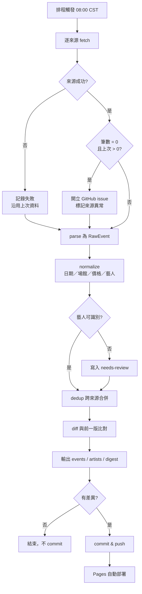
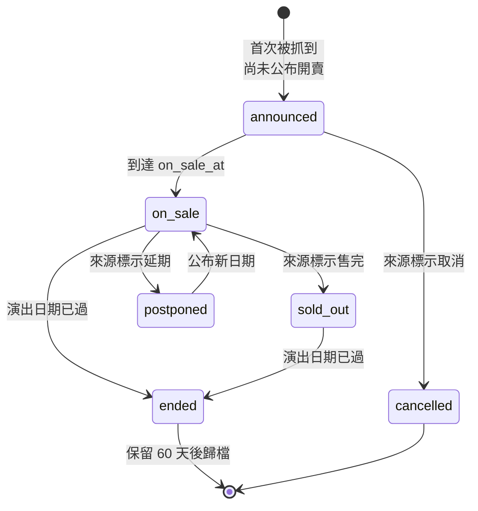
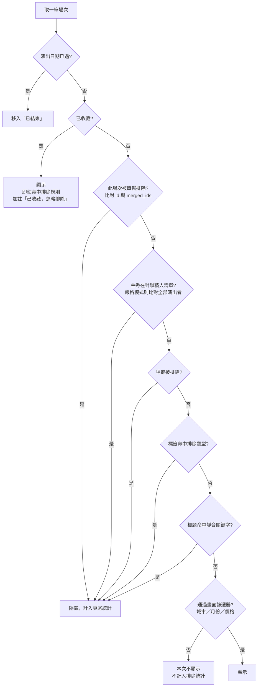
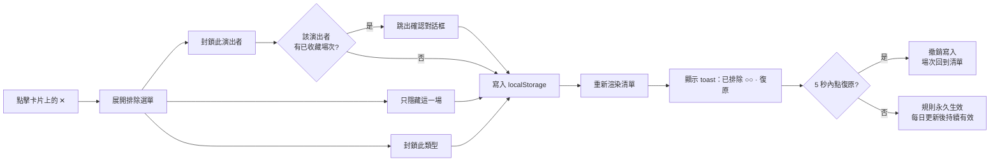
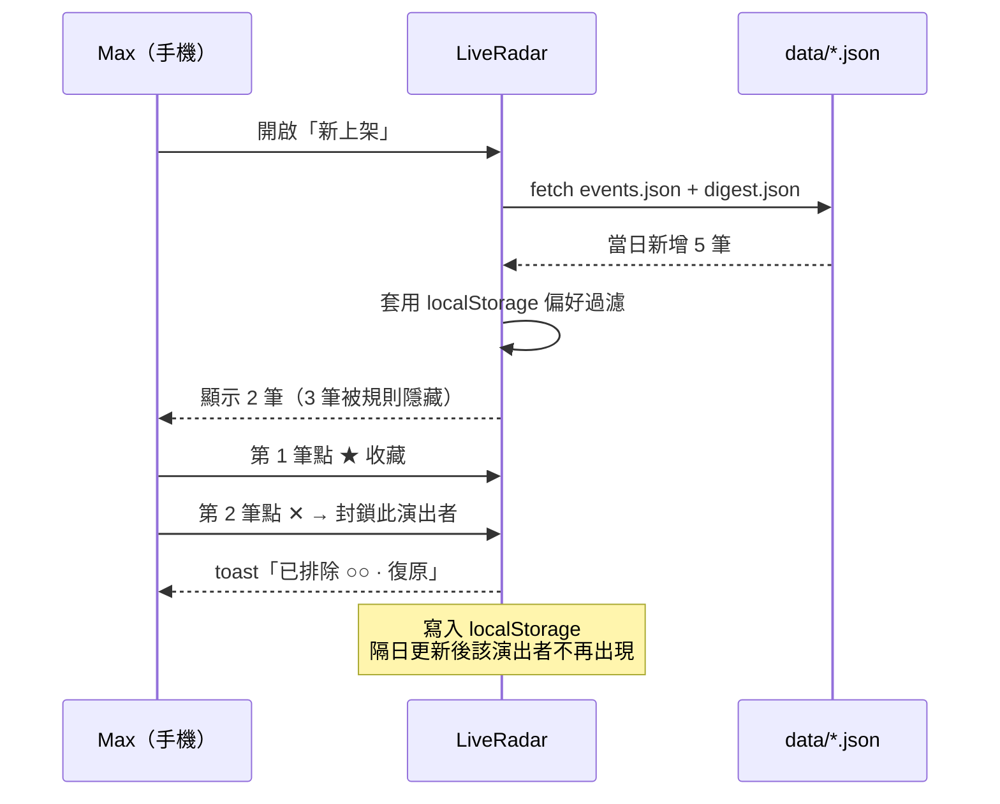

# LiveRadar 需求規格書（SRS / PRD）

| 項目 | 內容 |
|---|---|
| 文件版本 | **v1.0 — 決策已拍板，可進入 Wireframe 階段** |
| 撰寫日期 | 2026-09-14（v0.1 Draft → v1.0） |
| 產品負責人 | Max（同時為使用者、PM、SA） |
| 相關文件 | `LIVERADAR-SPEC.md`（技術架構與實作規格） |
| 本文件用途 | **開發前的需求確認基準**。第 9 節決策已全數拍板，可進入 Wireframe 階段 |

---

## 1. 問題定義

### 1.1 問題陳述

演出資訊分散在三類彼此不相通的管道，沒有單一入口：

1. **售票平台**（KKTIX、拓元、ibon、Accupass 等）— 結構化，但只收有正式售票的場次
2. **Livehouse 與場館官網** — 格式各異，更新不一
3. **社群媒體（最分散也最關鍵）** — 音樂人自己的 FB／IG 粉專、台灣主辦單位的粉專。許多場次**最早甚至只在這裡公布**，而且常以限時動態形式出現

而既有的彙整型網站與媒體懶人包偏重大型演唱會，獨立音樂與小型場次覆蓋不足。結果是**已經公布、票也還買得到的演出，因為沒看到而錯過**——尤其是海外樂團來台場次（通常只公布一次、開賣即秒殺）與台灣樂團自辦專場。

### 1.2 影響

| 面向 | 現況成本 |
|---|---|
| 錯過場次 | 無法回收，演出只有一次 |
| 主動搜尋成本 | 需定期巡 5–10 個來源，且容易漏 |
| 資訊雜訊 | 現有彙整站含大量無興趣內容（見面會、音樂劇、大型偶像演唱會），瀏覽效率低 |

### 1.3 為什麼現有方案不夠

| 方案 | 不足 |
|---|---|
| 媒體懶人包（遠見、Marie Claire 等）| 只收大型演唱會，更新被動，無個人化 `未查證：覆蓋率未實測` |
| 既有彙整站（如 Artists.tw）| 無收藏、無排除，雜訊無法收斂 |
| 追蹤 FB／IG 粉專 | 需追蹤數十個帳號（音樂人本人、主辦、場館）；演算法決定看不看得到，限時動態 24 小時消失，無結構化、無法回溯 |
| 售票平台的「關注」功能 | 綁單一平台，跨平台無法整合 |

---

## 2. 目標與非目標

### 2.1 目標（Goals）

| # | 目標 | 衡量方式 |
|---|---|---|
| G1 | 不再因為「沒看到資訊」而錯過想看的演出 | 每月事後盤點錯過場次數 → 目標 **0** |
| G2 | 每日確認演出資訊的時間壓到極短 | 每日開站到看完新增場次 **< 2 分鐘** |
| G3 | 看到的清單絕大多數是有興趣的 | 首頁前 20 筆中「有興趣」比例 **≥ 50%**（上線 1 個月後自評） |
| G4 | 資料覆蓋率足以取代人工巡站 | 對照既有彙整站抽樣 30 場，覆蓋率 **≥ 80%** |
| G5 | 維護成本可長期承受 | 每週手動介入（修 parser、整理藝人別名）**< 15 分鐘** |

### 2.2 非目標（Non-Goals）

| # | 明確不做 | 理由 |
|---|---|---|
| N1 | 購票、搶票自動化 | 售票平台反自動化，法遵與技術風險高，導流到官方頁即可 |
| N2 | 多人使用、分享、社群功能 | 單人工具，加上帳號系統會讓工程量翻倍 |
| N3 | 行動 App | PWA／RWD 網頁已足夠 |
| N4 | 即時（分鐘級）更新 | 每日一次可滿足 G1；高頻爬取增加被封鎖風險 |
| N5 | 演出評論、樂評、曲目清單 | 不解決核心問題，屬另一個產品 |
| N6 | 歷史演出完整資料庫 | 只保留近期已結束場次供回顧，不做完整歸檔 |

---

## 3. 使用者與使用情境

單一使用者，但有三種明顯不同的使用情境，功能需分別滿足：

| 情境 | 頻率 | 場合 | 需求 |
|---|---|---|---|
| **U1 每日快掃** | 每天 1 次 | 通勤／睡前，手機 | 只想看「今天新增了什麼」，30 秒內看完 |
| **U2 規劃排程** | 每週 1 次 | 桌機 | 看未來 1–3 個月，決定要去哪幾場、避開衝突 |
| **U3 開賣衝刺** | 不定期 | 收到提醒時 | 快速找到開賣時間與售票連結 |
| **U4 清理維護** | 每 1–2 週 | 桌機 | 整理未識別藝人、調整排除規則 |

---

## 4. 使用者故事

依優先度排序。ID 對應第 5 節功能需求。

### 4.1 看到資訊（核心）

- **US-01**｜身為聽團仔，我想在一個頁面看到未來所有演出，這樣就不用每天巡 5 個網站。
- **US-02**｜我想一眼看出「今天新增了哪些場次」，這樣每天只要花 30 秒。
- **US-03**｜我想清楚知道每場的**開賣時間**，這樣不會等到售完才發現。
- **US-04**｜我想看到票價與售票連結，這樣決定後能直接去買。
- **US-05**｜我想知道這筆資料來自哪個來源，這樣對時間有疑慮時能回查原始頁面。

### 4.2 收藏

- **US-06**｜我想把想看的演出加入收藏，這樣之後能快速找回。
- **US-07**｜我想在收藏清單看到距今天數，這樣能安排行程。
- **US-08**｜我想把收藏匯出到行事曆，這樣不會跟其他行程撞期。*(P1)*

### 4.3 排除（核心差異點）

- **US-09**｜我想把沒興趣的**演出者**封鎖，之後他所有場次都不再出現，而且**只需要做一次**。
- **US-10**｜我想把單一場次隱藏，但不影響同一位演出者的其他場次。
- **US-11**｜我想用**類型／關鍵字**批次排除（例如「見面會」），這樣不必逐一手動封鎖。
- **US-12**｜我想在誤按排除後能立刻復原，這樣不怕手殘。
- **US-13**｜我想隨時檢視並解除所有排除規則，這樣不會不知不覺過濾掉想看的東西。
- **US-14**｜我想知道目前有多少場次被規則隱藏，這樣能判斷規則是否過嚴。

### 4.4 維運

- **US-15**｜我想知道哪個來源今天抓失敗了，這樣能及時修，不會靜默漏資料。
- **US-16**｜我想把系統認不出來的藝人手動歸位，這樣封鎖規則會愈用愈準。
- **US-17**｜我想手動補上系統抓不到的場次（例如只發在 FB 的），這樣覆蓋率不會有破口。
- **US-18**｜我想備份我的收藏與排除清單，這樣換裝置或清瀏覽器資料時不會全毀。

---

## 5. 功能需求

優先級：**P0** 不做就無法解決核心問題｜**P1** 上線後快速補上｜**P2** v1 不做，但架構需預留。

### 5.1 資料採集（FR-1x）

| ID | 需求 | 優先 |
|---|---|---|
| FR-11 | 每日自動抓取設定來源的演出資訊 | P0 |
| FR-12 | 跨來源同一場次自動合併為單筆 | P0 |
| FR-13 | 單一來源失敗不影響其他來源，沿用上次資料並記錄失敗 | P0 |
| FR-14 | 來源異常（抓到 0 筆但上次 >0）自動告警 | P0 |
| FR-15 | 從標題抽取演出者並對照別名表正規化 | P0 |
| FR-16 | 未能識別的藝人／無法解析的日期進入「待整理」佇列 | P0 |
| FR-17 | 支援手動新增場次（用來補社群平台獨家資訊） | **P0** |
| FR-18 | 以 AI 輔助補齊未識別藝人與類型標籤（結果仍需人工確認） | P2 |
| FR-19 | 維護「追蹤名單」（音樂人／主辦／場館的社群帳號名稱），每週以 AI 網路搜尋巡檢，產出候選場次清單供人工確認後併入 | P1 |

**AC-11**
- Given 排程時間到達，When Actions 執行，Then 產生的 `events.json` 的 `generated_at` 為當日，且場次數 > 0。
- Given 來源 A 回應逾時，When pipeline 執行，Then 其他來源仍正常寫入，且 A 的 `last_success` 維持前一日、前端顯示警示。

**AC-12**
- Given 同一場演出同時存在於 KKTIX 與拓元，When 去重執行，Then 前端只顯示 1 筆，且售票連結指向優先序較高的來源，原始連結全數保留。
- Given 兩場同日同場館但為不同演出（早場／晚場），When 去重執行，Then **不得**被誤併為 1 筆。

**AC-14**
- Given 來源 B 昨日抓到 42 筆、今日抓到 0 筆，When pipeline 執行，Then 自動開立 GitHub issue 並在前端標示該來源異常。

**AC-15**
- Given 標題為「ABC Band 2026 Asia Tour - Taipei w/ 小明樂團」，When 藝人抽取執行，Then 解析出 `ABC Band`（主秀）與`小明樂團`，且年份、`Asia Tour`、`Taipei` 不得被當成藝人。

**AC-17**
- Given 使用者在 FB 看到一場系統沒抓到的演出，When 使用手動新增功能填入日期、演出者、場館、售票連結，Then 該場次出現在時間表中，且與自動抓取的場次行為一致（可收藏、可排除）。
- Given 手動新增的場次日後也被自動抓到，When 去重執行，Then 合併為 1 筆，**不得**重複顯示。

**AC-19**
- Given 追蹤名單中有 30 個帳號，When 每週巡檢執行，Then 產出候選場次清單進入「待整理」頁，每筆附上資訊來源連結供人工核實；未經確認者**不得**直接進入主時間表。

---

### 5.2 資訊呈現（FR-2x）

| ID | 需求 | 優先 |
|---|---|---|
| FR-21 | 以日期分組顯示未來場次時間表 | P0 |
| FR-22 | 每筆顯示：日期時間、演出者、場館＋城市、票價、狀態、售票連結、來源 | P0 |
| FR-23 | 「新上架」檢視：當日／近 7 日新增場次 | P0 |
| FR-24 | 開賣時間未到者明確標示「即將開賣 + 倒數」 | P0 |
| FR-25 | 篩選：城市、月份、只看收藏、價格區間 | P1 |
| FR-26 | 已結束場次自動移出主清單 | P0 |
| FR-27 | 手機優先的 RWD、深淺色跟隨系統 | P0 |
| FR-28 | 演出者檢視：列出有未來場次的藝人，可直接封鎖 | P1 |

**AC-21**
- Given 今天是 2026-10-01，When 開啟首頁，Then 清單第一筆為今日或之後的場次，且不含任何過去日期。

**AC-24**
- Given 某場次 `on_sale_at` 在 3 天後，When 渲染，Then 該卡片顯示「3 天後開賣」樣式且優先排序於同日其他場次之前。
- Given `on_sale_at` 為 null（尚未公布），When 渲染，Then 顯示「開賣時間未公布」，**不得**顯示為已開賣。

**AC-23**
- Given 昨日資料有 100 筆、今日 105 筆且其中 5 筆為新增，When 開啟「新上架」，Then 恰好顯示該 5 筆。

---

### 5.3 收藏（FR-3x）

| ID | 需求 | 優先 |
|---|---|---|
| FR-31 | 單鍵收藏／取消收藏場次 | P0 |
| FR-32 | 收藏清單獨立檢視，依日期排序並顯示距今天數 | P0 |
| FR-33 | 收藏優先於所有排除規則，**永不被過濾掉** | P0 |
| FR-34 | 收藏場次的關鍵欄位變動（時間、場館、狀態）時標示「已更新」 | P1 |
| FR-35 | 收藏匯出為 .ics | P2 |

**AC-33**
- Given 已收藏場次 E，且 E 的主秀後來被加入封鎖清單，When 瀏覽首頁，Then E **仍然顯示**，並標註「已收藏，忽略排除規則」。

**AC-34**
- Given 已收藏場次 E 的演出時間由 19:30 改為 20:00，When 隔日開站，Then E 顯示「資訊已更新」提示並可查看變更內容。

---

### 5.4 排除（FR-4x）— 產品核心

| ID | 需求 | 優先 |
|---|---|---|
| FR-41 | 排除單一場次（不影響同演出者其他場次） | P0 |
| FR-42 | 排除演出者（該演出者**所有未來場次**永久不再出現） | P0 |
| FR-43 | 排除類型／關鍵字（命中標題或標籤即隱藏） | P0 |
| FR-44 | 排除規則**持久生效**：每日資料更新後仍然有效，無需重設 | P0 |
| FR-45 | 排除後 5 秒內可一鍵復原（toast） | P0 |
| FR-46 | 「已隱藏管理」頁：列出所有規則及各自隱藏的未來場次數，可逐條解除 | P0 |
| FR-47 | 頁尾常駐提示「另有 N 場被規則隱藏 · 查看」 | P0 |
| FR-48 | 封鎖演出者前，若其場次曾被收藏則跳出確認 | P1 |
| FR-49 | 排除場館／主辦 | P2 |

**AC-42 / AC-44（本產品最關鍵的驗收）**
- Given 使用者於 D 日封鎖演出者 A，When D+1 日資料自動更新且新增了 A 的 3 場新演出，Then 首頁**不得**出現 A 的任何場次，使用者無需再操作。
- Given 演出者 A 已被封鎖，When 使用者於「已隱藏管理」解除封鎖，Then A 的所有未來場次**立即**重新出現，不需等待下次資料更新。

**AC-41**
- Given 演出者 A 有 3 場演出，When 使用者對其中 1 場選擇「只隱藏這一場」，Then 該場消失、另外 2 場仍顯示。

**AC-45**
- Given 使用者誤按排除，When 於 toast 顯示期間點「復原」，Then 該場次立即回到清單，且排除規則未被寫入。

**AC-47**
- Given 目前有 23 場被排除規則隱藏，When 瀏覽首頁，Then 頁尾顯示「另有 23 場被你的排除規則隱藏」並可點開檢視。

**負向測試**
- 排除操作**不得**導致該場次從資料檔中被刪除。
- 解除封鎖後**不得**需要等待次日更新才恢復。
- 資料來源改版導致場次 ID 變動時，已排除項目**不得**重新出現（ID 穩定性要求，見 `LIVERADAR-SPEC.md` §3、§4）。

---

### 5.5 提醒（FR-5x）

| ID | 需求 | 優先 |
|---|---|---|
| FR-51 | 站內標示「即將開賣」 | P0 |
| FR-52 | 外部推播（Telegram／Email）：新上架且命中追蹤條件者 | P2 |
| FR-53 | 開賣前 24 小時提醒已收藏場次 | P2 |

> 註：FR-52／FR-53 需要伺服器端知道使用者的偏好清單，牽涉偏好同步（見 `LIVERADAR-SPEC.md` §9 Phase 3），故列 P2。

---

### 5.6 資料維運（FR-6x）

| ID | 需求 | 優先 |
|---|---|---|
| FR-61 | 「待整理」頁：未識別藝人、無法解析日期的場次 | P0 |
| FR-62 | 各來源狀態儀表（最後成功時間、抓取筆數） | P0 |
| FR-63 | 偏好資料匯出／匯入 JSON | P0 |
| FR-64 | 首次使用提示備份；設定頁顯示「上次備份日期」 | P0 |
| FR-65 | 偏好自動同步至使用者帳號，手機與桌機保持一致（2026-09-20 起：Google 帳號登入 + Supabase，見 SPEC §8；原規劃是 private Gist，已取代） | **P0** |
| FR-66 | 維護「追蹤名單」的編輯介面（供 FR-19 使用） | P1 |

**AC-63**
- Given 使用者已收藏 12 場、封鎖 8 位藝人，When 匯出後於另一瀏覽器匯入，Then 收藏與封鎖狀態完全還原。

**AC-65**
- Given 使用者在手機上封鎖演出者 A，When 於桌機開啟同一網址並完成同步，Then 桌機端也看不到 A 的場次，無需手動匯出匯入。
- Given 使用者未登入，或已登入但 Supabase 連不上（離線／API 失敗），When 開站，Then 仍以本機 localStorage 正常運作，**不得**因此清空本機偏好——登入是加分項不是門檻。

---

### 5.7 非功能需求（NFR）

| ID | 需求 | 標準 |
|---|---|---|
| NFR-01 | 首頁載入到可互動 | 4G 網路 < 2 秒 |
| NFR-02 | 過濾／收藏／排除操作反應 | < 100ms（純前端運算） |
| NFR-03 | 資料更新頻率 | 每日 1 次，08:00 CST |
| NFR-04 | 爬取禮儀 | 遵守 robots.txt；請求間隔 ≥ 2 秒；可辨識 UA |
| NFR-05 | 資料使用範圍 | 僅個人使用；不重製全文；保留原始連結導流 |
| NFR-06 | 成本 | 全程使用免費額度（GitHub Pages + Actions） |
| NFR-07 | 可維護性 | 新增一個資料來源只需新增一個 adapter 檔，不動其他程式 |

---

## 6. 流程與狀態

### 6.1 每日更新流程

### 6.2 場次生命週期狀態機

> 若場次已被收藏，狀態轉為 `cancelled` / `postponed` / `sold_out` 時必須在收藏頁明確標示（FR-34）。

### 6.3 單筆場次的顯示判定（前端過濾決策樹）

此順序不可調換，否則 FR-33（收藏優先）與 FR-44（排除持久）會失效。

### 6.4 排除操作的互動流程

### 6.5 使用者旅程：每日快掃（U1）

---

## 7. 成功指標與量測方式

| 類型 | 指標 | 目標 | 量測方式 | 檢視時點 |
|---|---|---|---|---|
| 先行 | 資料覆蓋率 | ≥ 80% | 對照既有彙整站抽樣 30 場人工比對 | 上線後第 1、4 週 |
| 先行 | 每日使用時間 | < 2 分鐘 | 自評 | 上線後第 2 週 |
| 先行 | 首頁前 20 筆「有興趣」比例 | ≥ 50% | 自評計數 | 第 2、6 週 |
| 先行 | 排除規則累積數 | 穩定成長後趨緩 | 設定頁統計 | 持續 |
| 落後 | 錯過想看的演出次數 | 0 次／月 | 每月回顧 | 每月 |
| 落後 | 每週維護時間 | < 15 分鐘 | 自評 | 每月 |
| 健康度 | 來源連續失敗天數 | 0 | 來源狀態儀表 | 持續 |

> **失敗訊號**：若第 6 週「首頁前 20 筆有興趣比例」仍 < 30%，代表排除顆粒度設計錯誤（可能需要改為白名單模式：只看追蹤的藝人與場館），需回頭調整需求而非加功能。

---

## 8. 範圍與分期

| 階段 | 範圍 | 完成定義 |
|---|---|---|
| **Phase 1 — 可用** | FR-11~17、FR-21~24、FR-26~27、FR-31~33、FR-41~47、FR-61~65、全部 NFR | 連續兩日自動更新後，AC-42／AC-44 通過；手機與桌機偏好同步驗證通過 |
| **Phase 2 — 好用** | FR-19、FR-25、FR-28、FR-34、FR-48、FR-66 | 覆蓋率達標 ≥ 80% |
| **Phase 3 — 加分** | FR-18、FR-35、FR-49、FR-52~53、「我去過的演出」紀錄 | 依實際使用痛點再決定是否做 |

> **與 v0.1 的差異**：FR-17（手動新增場次）與 FR-65（當時稱為「Gist 同步」，2026-09-20 起改為 Supabase + Google 登入，內容不變只是機制換了）自 Phase 2 提前至 Phase 1。前者是社群平台獨家資訊的唯一補救管道，後者是因為每日快掃在手機、週末規劃在桌機，跨裝置同步屬核心情境而非加分項。

**排程限制**：無硬性截止日。但演出資訊具季節性，建議 Phase 1 於 **年底跨年檔期與春季音樂祭公布潮之前**上線，以獲得有意義的驗證資料。

---

## 9. 決策紀錄（已拍板）

v1.0 定案。日後若要變更，請在此表加註變更日期與理由，避免開發中途口頭改動。

### 9.1 產品行為

| # | 決策 | 結論 |
|---|---|---|
| D1 | 更新時間 | **每日 08:00 CST**（Actions cron `0 0 * * *` UTC） |
| D2 | 拼盤演出封鎖判定 | **只有主秀命中才隱藏**；配角命中不隱藏。另提供「嚴格模式」開關（設定頁，預設關閉） |
| D3 | 收藏優先序 | **收藏優先於所有排除規則**，已收藏場次永不被過濾，並標註「已收藏，忽略排除規則」 |
| D4 | 地理範圍 | **全台** |
| D5 | 音樂祭 | **視為 1 筆場次**。陣容藝人記於 `lineup` 欄位；陣容中某藝人被封鎖**不影響**該音樂祭顯示（僅主辦／音樂祭本身被封鎖才隱藏） |
| D6 | 已結束場次 | 保留 60 天後歸檔。「我去過的演出」紀錄列為 **Phase 3 後續優化** |

### 9.2 類型標籤（tags）定版

排除功能僅依據以下兩類標籤運作。**不做規模場地、不做曲風分類。**

| 類別 | 標籤 | 用途 |
|---|---|---|
| **演出性質** | `專場` `巡迴` `拼盤` `音樂祭` `見面會` `簽唱會` `音樂劇` `古典` | 主要排除依據（例如一次排除所有「見面會」） |
| **來源地** | `本地` `亞洲其他` `日韓` `歐美` | 篩選與排除輔助（原本叫「海外」，2026-09-21 改名，見 LIVERADAR-SPEC.md §3.2） |

- **D7**：採上表，移除原草案的「規模場地」與「曲風」兩類。
- **D8**：曲風標籤不做，故無資料來源問題。

> **取捨提醒**：拿掉「規模場地」後，「不想看大型場館的演唱會」只能靠 FR-49 逐一封鎖場館（Phase 3）。若實際使用時發現大型演唱會雜訊仍多，最低成本的補救是把 `小巨蛋` `高雄巨蛋` `流行音樂中心` 等場館名加進靜音關鍵字（FR-43 已支援），不需改架構。

### 9.3 資料來源定版

| # | 決策 | 結論 |
|---|---|---|
| D9 | Phase 1 來源清單 | **KKTIX ＋ 拓元 tixcraft ＋ 手動新增（FR-17）** |
| D10 | Facebook／Instagram | **不直接爬取**。改以 FR-17 手動補件（Phase 1）＋ FR-19 追蹤名單 AI 週巡檢（Phase 2）涵蓋 |
| D11 | 既有彙整站 | **不納入爬取**，僅作為覆蓋率抽樣比對的基準 |

**D9 選擇理由**：這兩個來源直接對應你的核心痛點。KKTIX 是台灣 Livehouse 與獨立演出的主要售票平台，涵蓋 The Wall、Legacy 等場館的自營頁面；拓元則是海外樂團大型來台場次的主力售票通路 `未查證：兩者覆蓋率需於開發第一步實測`。Accupass、ibon、iNDIEVOX、寬宏、年代列為 Phase 2 候補，依 Phase 1 上線後的覆蓋率缺口決定補哪一個——先上線再補，比一次做五個來源卻延後兩週上線划算。

**Phase 1 KKTIX 起始 org 清單**（開發時實測確認，未存活者移除）：The Wall、Legacy Taipei、Legacy Taichung、海邊的卡夫卡、Pipe Live Music、Revolver、浮現藝文展演空間、Clapper Studio。

### 9.4 技術與維運定版

| # | 決策 | 結論 |
|---|---|---|
| D12 | 偏好同步 | **Phase 1 即實作跨裝置同步**（原規劃 Phase 2，已提前，理由見 §8）。原本用 Gist，2026-09-20 起改為 Supabase + Google 登入（SPEC §8、決策 S6），提前的理由不變 |
| D13 | repo 公開性 | **public repo + 免費 GitHub Pages**；偏好資料存在使用者自己 Supabase 帳號底下（RLS 只限本人讀寫），不隨 repo 公開 |
| D14 | 前端技術 | **原生 JavaScript（ES Modules）＋ 原生 CSS，不使用框架、不使用打包工具** |
| D15 | AI 呼叫預算 | **Phase 1 完全不用 AI**；Phase 2 的 FR-19 週巡檢每週上限 30 次呼叫；Phase 3 的 FR-18 每日上限 50 次。合計月費用上限設 US$5，超出即停用並發 issue |

**D14 選擇理由**：頁面數 6、資料量低於 5MB、全部運算在前端且無伺服器狀態，框架帶來的收益有限，而不使用打包工具意味著**改一行 CSS 就能直接 commit 上線、不需要 build step**，這對 G5（每週維護 < 15 分鐘）的幫助大於框架的開發便利性。若日後畫面複雜度顯著上升，可改用 Preact + htm（同樣免打包）漸進遷移，不需重寫。

**D15 選擇理由**：Phase 1 的藝人識別靠人工維護的 `artists.yml` 別名表即可運作，且人工表的準確度高於 AI 推測。先累積兩個月的真實資料，再判斷 AI 要補的是哪一塊，比一開始就接 API 更省錢也更準。

---

## 10. 風險

| # | 風險 | 機率 | 影響 | 對策 |
|---|---|---|---|---|
| R1 | 來源改版導致 parser 靜默失效 | 高 | 高（資料缺漏且不自知） | FR-14 自動告警 + FR-62 來源狀態儀表 |
| R2 | 場次 ID 不穩定導致排除規則失效 | 中 | 高（核心價值崩壞） | ID 由來源穩定欄位雜湊；保留 `merged_ids`；納入回歸測試 |
| R3 | 排除過頭反而錯過想看的 | 中 | 中 | FR-45 復原、FR-46 管理頁、FR-47 頁尾統計 |
| R4 | localStorage 遺失 | 中 | 高（長期資產歸零） | FR-63/64 備份提示；FR-65 帳號同步（Supabase） |
| R5 | 藝人正規化品質不佳，封鎖不精準 | 高 | 中 | FR-16 待整理佇列；別名表持續累積；D2 主秀判定降低誤殺 |
| R6 | 覆蓋率不足，仍需人工巡站（G1 失守） | 中 | 高 | 上線第 1 週即執行覆蓋率抽樣；不足則優先補來源而非做新功能 |
| R7 | 維護成本超出預期而棄用 | 中 | 高 | NFR-07 adapter 架構；每週維護時間納入成功指標監控 |

---

## 11. 文件對應關係

| 需求層級 | 文件 | 對應章節 |
|---|---|---|
| 為什麼做、做什麼、驗收什麼 | **本文件 SRS** | §1–§9 |
| 怎麼做（資料模型、pipeline、演算法、repo 結構） | `LIVERADAR-SPEC.md` | §2–§12 |
| 過濾順序 | 本文件 §6.3 ↔ SPEC §6 | 兩份必須一致，修改需同步 |
| ID 穩定性與去重 | 本文件 AC-42/負向測試 ↔ SPEC §3、§4 | — |

---

## 12. 尚未納入本版的文件（需要時再補）

- 畫面規格書（每畫面的區塊、欄位、空白／載入／錯誤狀態、互動規則）
- 資料字典（欄位型別、必填、長度、範例值）
- 測試案例清單（可執行的 test case 與測資）

> 若要進入正式開發排程，建議至少補上「畫面規格書」與「資料字典」；本文件的 AC 已可支撐單元與整合測試的撰寫。

---

## 13. 開發旅程與各階段交付物

對應你的既有流程，標示每一關的**入關條件**與**出關條件**，避免帶著未定事項往下走。

| # | 階段 | 交付物 | 入關條件 | 出關條件（Gate） |
|---|---|---|---|---|
| 1 | **定義需求與架構** ✅ | 本文件 SRS v1.0 + `LIVERADAR-SPEC.md` | — | ~~§9 決策拍板，SRS 升版 v1.0~~ **已完成** |
| 2 | **產出 Wireframe** | 低保真線框：時間表／新上架／收藏／已隱藏管理／待整理／設定，共 6 畫面 + 排除選單與 toast 的互動狀態 | SRS v1.0 | 每個 P0 功能需求都能在線框上指出對應位置；空白／載入／錯誤狀態都有畫 |
| 3 | **產出設計稿** | 高保真視覺稿 + 卡片元件規格（狀態色、標籤樣式、深淺色） | Wireframe 確認 | 手機與桌機兩種斷點皆完成；元件可直接對應到前端 CSS |
| 4 | **開發** | 依 `LIVERADAR-SPEC.md` §11 分階段實作 | 設計稿確認 | Phase 1 全部 AC 通過，**特別是 AC-42／AC-44** |
| 5 | **反覆修改與 Debug** | 測試案例清單 + 覆蓋率抽樣報告 | 功能完成 | 連續 7 日自動更新無中斷；覆蓋率抽樣 ≥ 80% |
| 6 | **上架** | GitHub Pages 正式網址 + README | Gate 5 通過 | 可從手機正常使用，偏好備份機制已驗證 |
| 7 | **維護** | 每週維護紀錄；來源異常自動 issue | 上線 | 每週維護時間 < 15 分鐘（G5） |

### 目前位置與下一步

**階段 1 已出關**，下一步是階段 2 Wireframe。

因決策而確定的畫面清單（共 7 個，較 v0.1 增加「手動新增」）：

| # | 畫面 | 對應需求 |
|---|---|---|
| 1 | 時間表（首頁） | FR-21~24、FR-26~27、FR-41~47 |
| 2 | 新上架 | FR-23 |
| 3 | 我的收藏 | FR-31~33 |
| 4 | 已隱藏管理 | FR-46 |
| 5 | 待整理 | FR-16、FR-61 |
| 6 | 手動新增場次 | FR-17 |
| 7 | 設定（同步、備份、嚴格模式、靜音關鍵字、來源狀態） | FR-62~65、D2 |

另需畫出的互動狀態：排除選單展開、復原 toast、封鎖已收藏藝人的確認對話框、空白／載入／來源異常三種狀態。

**D9 的端點實測**（KKTIX 與拓元的實際回應結構）可與 Wireframe 並行進行，不阻斷設計。

> **這份 SRS 之於 Wireframe 的關鍵輸入**：§5 的 FR 清單決定畫面上要有哪些元素，§6.3 的過濾決策樹決定「頁尾統計」與「已收藏忽略排除」這兩個容易被漏掉的 UI，§6.4 決定排除選單必須是多選項而非單一按鈕。畫線框時請把這三處攤開對照。

---

## 附註：資訊查證狀態

本文件中關於外部平台覆蓋率、API 端點、GitHub 方案限制等描述均標記 `未查證`。撰寫當下的網頁抓取請求未能完成驗證，**D9 定版前必須逐一實測**。已查證的參考來源：

- [KKTIX 官方站](https://kktix.com/)｜[The Wall Live House @ KKTIX](https://thewalllivehouse.kktix.cc/)｜[kktix-api 第三方函式庫](https://github.com/twentyfour7/kktix-api)
- [Bandsintown API 官方說明](https://help.artists.bandsintown.com/en/articles/7053475-what-is-the-bandsintown-api)
- [Artists.tw 2026 台灣演唱會行事曆](https://www.artists.tw/gigs/)
